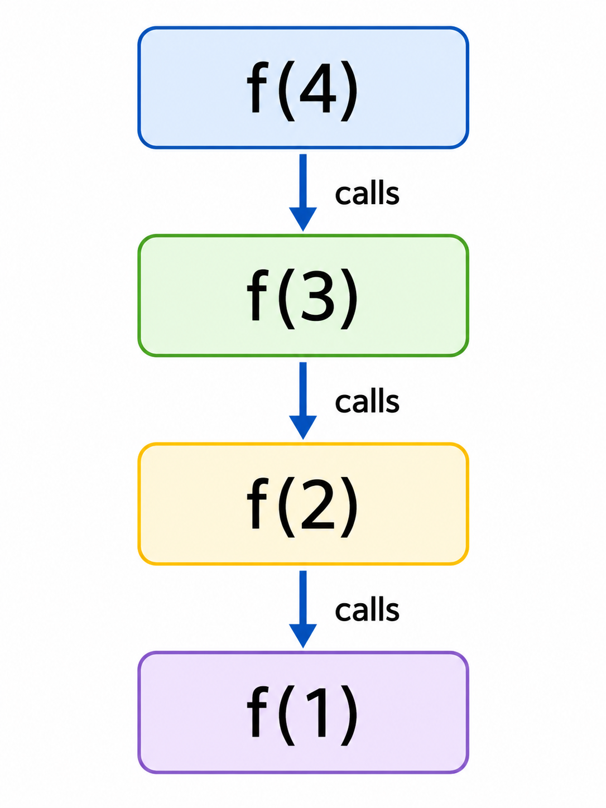
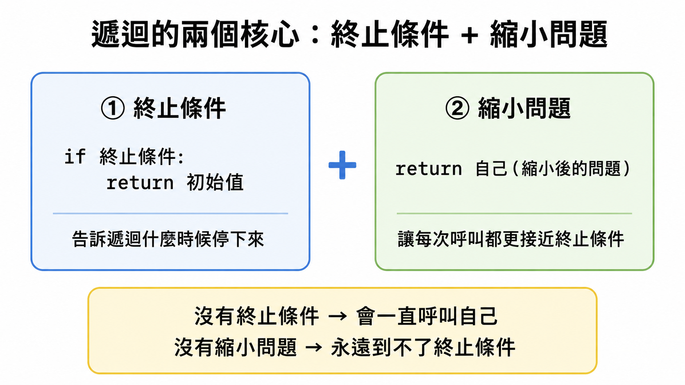
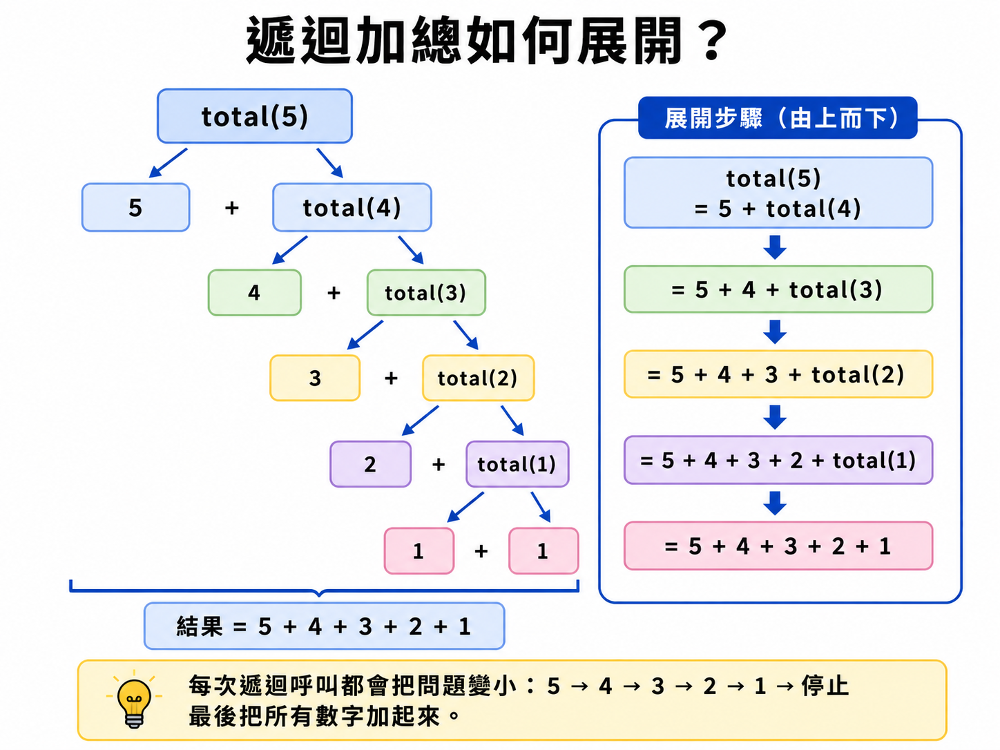

# Lesson 02：遞迴 Recursion

遞迴是一種「函式呼叫自己」的寫法。

學習如何看懂遞迴、設計遞迴的終止條件，並用遞迴解決加總、階乘、次方與費氏數列等問題。

> 這堂課的重點：遞迴不是一直呼叫自己，而是每一次都要讓問題變小，最後停在終止條件。
> 

---

## Section I. 今天要做什麼？

1. 認識什麼是遞迴函式。
2. 理解遞迴一定要有「終止條件」。
3. 學會遞迴函式的基本結構。
4. 練習常見遞迴題型：加總、階乘、次方、費氏數列。
5. 比較遞迴與迴圈的差別。
6. 練習 ZeroJudge 遞迴題目。

---

## Section II. 今天的學習方式

這堂課不是要你背很多公式，而是要你學會看懂遞迴的三個重點：

1. 什麼時候停止？
2. 每次呼叫自己時，問題有沒有變小？
3. 回傳值怎麼一層一層算回來？

你可以先把遞迴想成：

```
我不一次做完整件事。
我只做一小步，剩下的交給「縮小版的自己」處理。
```

---

## Section III. 今天會學到的內容

| 主題 | 你需要知道的事 |
| --- | --- |
| 遞迴函式 | 函式裡面呼叫自己。 |
| 終止條件 | 避免函式無限呼叫自己。 |
| 遞迴關係 | 把大問題拆成小問題。 |
| 加總 | `sum(n) = n + sum(n-1)` |
| 階乘 | `n! = n * (n-1)!` |
| 次方 | `x^n = x * x^(n-1)` |
| 費氏數列 | `F(n) = F(n-1) + F(n-2)` |
| 遞迴與迴圈 | 有些問題兩種方式都能寫。 |

---

## Section IV. 寫遞迴前的提醒

### 1. 遞迴一定要有終止條件

如果函式一直呼叫自己，程式會停不下來。

錯誤示範：

```python
def f(n):
    return f(n - 1)
```

這個函式沒有停止條件，所以會一直呼叫下去。

---

### 2. 每次遞迴都要讓問題變小

例如計算 `1 + 2 + 3 + ... + n`：

```python
def total(n):
    if n == 1:
        return 1
    return n + total(n - 1)
```

這裡的 `total(n - 1)` 就是把問題變小。

---

### 3. Python 有遞迴層數限制

Python 的遞迴呼叫不能無限加深。

如果呼叫太多層，可能會出現：

```
RecursionError: maximum recursion depth exceeded
```

一般初學時可以先記住：遞迴很適合用來理解問題結構，但不是所有情況都適合用遞迴。

---

## Section V. 核心概念說明



### 1. 什麼是遞迴？

遞迴函式是指「會在函式中呼叫自己的函式」。

範例：

```python
def a(i):
    if i < 1:
        return 1
    return a(i - 1)
```

在這段程式中，`a(i)` 會呼叫 `a(i - 1)`。

所以 `a()` 是一個遞迴函式。

---

### 2. 遞迴函式的基本結構



遞迴通常可以分成兩個部分：

```python
def recursion_func(p):
    if 終止條件:
        return 初始值

    return recursion_func(縮小後的問題)
```

可以用這個方式記：

```
先寫什麼時候停。
再寫如何呼叫比較小的自己。
```

---

### 3. 遞迴設計三步驟

| 步驟 | 要做什麼 |
| --- | --- |
| STEP 1 | 找終止條件。 |
| STEP 2 | 找遞迴關係。 |
| STEP 3 | 確認每次問題都有變小。 |

例如階乘：

```
5! = 5 * 4!
4! = 4 * 3!
3! = 3 * 2!
2! = 2 * 1!
1! = 1
```

所以可以寫成：

```python
def factorial(n):
    if n == 1:
        return 1
    return n * factorial(n - 1)
```

---

## Section VI. 常見遞迴範例

### Ex.1 連續加法



計算：

```
1 + 2 + 3 + ... + n
```

遞迴想法：

```
total(n) = n + total(n - 1)
total(1) = 1
```

Python 範例：

```python
def total(n):
    if n == 1:
        return 1
    return n + total(n - 1)

print(total(5))
```

結果：

```
15
```

---

### Ex.2 階乘


階乘的定義：

```
n! = n * (n - 1) * (n - 2) * ... * 1
```

遞迴想法：

```
f(n) = n * f(n - 1)
f(0) = 1
```

Python 範例：

```python
def f(n):
    if n == 0:
        return 1
    return n * f(n - 1)

print(f(5))
```

結果：

```
120
```

---

### Ex.3 指數：計算 x 的 n 次方

### 寫法 1：一步一步乘

遞迴想法：

```
power(x, n) = x * power(x, n - 1)
power(x, 0) = 1
```

Python 範例：

```python
def power(x, n):
    if n == 0:
        return 1
    return x * power(x, n - 1)

print(power(2, 5))
```

結果：

```
32
```

---

### 寫法 2：快速次方

當 `n` 很大時，可以用「平方」減少呼叫次數。

```python
def fast_power(x, n):
    if n == 0:
        return 1

    half = fast_power(x, n // 2)

    if n % 2 == 0:
        return half * half
    else:
        return half * half * x

print(fast_power(2, 5))
```

結果：

```
32
```

---

### Ex.4 費氏數列 Fibonacci Numbers


費氏數列定義：

```
F(0) = 0
F(1) = 1
F(n) = F(n - 1) + F(n - 2)
```

Python 範例：

```python
def fib(n):
    if n == 0:
        return 0
    if n == 1:
        return 1
    return fib(n - 1) + fib(n - 2)

print(fib(6))
```

結果：

```
8
```

提醒：

```
費氏數列用單純遞迴會重複計算很多次。
如果 n 很大，執行速度會很慢。
```

---

### Ex.5 阿克曼函數

阿克曼函數是一個比較進階的遞迴例子。

```python
def A(m, n):
    if m == 0:
        return n + 1
    else:
        if n == 0:
            return A(m - 1, 1)
        return A(m - 1, A(m, n - 1))
```

這個函式會非常快地增加遞迴深度。

初學時只需要知道：

```
阿克曼函數是很深的遞迴範例，不適合拿很大的數字測試。
```

---

### Ex.6 二項式係數

二項式係數常寫成：

```
C(n, m)
```

遞迴想法：

```
C(n, m) = C(n - 1, m - 1) + C(n - 1, m)
C(n, 0) = 1
C(n, n) = 1
```

Python 範例：

```python
def C(n, m):
    if m == 0 or m == n:
        return 1
    return C(n - 1, m - 1) + C(n - 1, m)

print(C(5, 2))
```

結果：

```
10
```

---

## Section VII. 遞迴 V.S. 迴圈

有些問題可以用迴圈寫，也可以用遞迴寫。

例如：計算 `0 + 1 + 2 + ... + 9`

---

### 寫法 1：for 迴圈

```python
ans = 0

for i in range(10):
    ans += i

print(ans)
```

結果：

```
45
```

---

### 寫法 2：while 迴圈

```python
i = 0
ans = 0

while i <= 9:
    ans += i
    i += 1

print(ans)
```

結果：

```
45
```

---

### 寫法 3：遞迴

```python
def func(i):
    if i == 0:
        return 0
    return i + func(i - 1)

print(func(9))
```

結果：

```
45
```

---

### 遞迴與迴圈比較

| 寫法 | 優點 | 缺點 |
| --- | --- | --- |
| 迴圈 | 執行通常比較穩定 | 有時候不容易看出問題結構 |
| 遞迴 | 很適合描述「問題拆小」 | 如果層數太深可能會超過限制 |

---

## Section VIII. 快速概念檢查

請先不要急著執行，先用眼睛看，猜猜看答案。

---

### Q1. 基本遞迴

```python
def f(n):
    if n == 1:
        return 1
    return n + f(n - 1)

print(f(4))
```

Question:

```
你覺得結果會是什麼？
```

Answer:

```
10
```

Explanation:

```
f(4) = 4 + f(3)
f(3) = 3 + f(2)
f(2) = 2 + f(1)
f(1) = 1

所以結果是 4 + 3 + 2 + 1 = 10。
```

---

### Q2. 階乘

```python
def f(n):
    if n == 0:
        return 1
    return n * f(n - 1)

print(f(4))
```

Question:

```
你覺得結果會是什麼？
```

Answer:

```
24
```

Explanation:

```
f(4) = 4 * 3 * 2 * 1 = 24
```

---

### Q3. 終止條件

```python
def f(n):
    return f(n - 1)

print(f(5))
```

Question:

```
這段程式可能會發生什麼問題？
```

Answer:

```
會一直呼叫自己，最後可能出現 RecursionError。
```

Explanation:

```
因為這個函式沒有終止條件，所以不會停下來。
```

---

### Q4. 費氏數列

```python
def fib(n):
    if n == 0:
        return 0
    if n == 1:
        return 1
    return fib(n - 1) + fib(n - 2)

print(fib(5))
```

Question:

```
你覺得結果會是什麼？
```

Answer:

```
5
```

Explanation:

```
F(0)=0, F(1)=1
F(2)=1
F(3)=2
F(4)=3
F(5)=5
```

---

## Section IX. 程式閱讀練習

### 題目 1：遞迴加總

```python
def total(n):
    if n == 1:
        return 1
    return n + total(n - 1)

print(total(6))
```

思考方式：

```
total(6) = 6 + total(5)
total(5) = 5 + total(4)
total(4) = 4 + total(3)
total(3) = 3 + total(2)
total(2) = 2 + total(1)
total(1) = 1
```

所以答案是：

```
21
```

---

### 題目 2：遞迴倒數

```python
def countdown(n):
    if n == 0:
        print("Go")
        return

    print(n)
    countdown(n - 1)

countdown(3)
```

思考方式：

```
先印出 3
再呼叫 countdown(2)
再印出 2
再呼叫 countdown(1)
再印出 1
最後遇到 countdown(0)，印出 Go
```

所以輸出是：

```
3
2
1
Go
```

---

### 題目 3：return 的順序


```python
def f(n):
    if n == 1:
        return 1

    ans = f(n - 1)
    return ans + n

print(f(4))
```

思考方式：

```
f(4) 會先等 f(3) 回傳。
f(3) 會先等 f(2) 回傳。
f(2) 會先等 f(1) 回傳。
f(1) 回傳 1。
接著一層一層加回去。
```

所以答案是：

```
10
```

---

## Section X. 遞迴實作練習

### 練習 1：寫出 1 到 n 的總和

請完成函式：

```python
def total(n):
    # 請寫在這裡
```

範例：

```python
print(total(5))
```

輸出：

```
15
```

參考解答：

```python
def total(n):
    if n == 1:
        return 1
    return n + total(n - 1)
```

---

### 練習 2：寫出階乘

請完成函式：

```python
def factorial(n):
    # 請寫在這裡
```

範例：

```python
print(factorial(5))
```

輸出：

```
120
```

參考解答：

```python
def factorial(n):
    if n == 0:
        return 1
    return n * factorial(n - 1)
```

---

### 練習 3：寫出 x 的 n 次方

請完成函式：

```python
def power(x, n):
    # 請寫在這裡
```

範例：

```python
print(power(2, 5))
```

輸出：

```
32
```

參考解答：

```python
def power(x, n):
    if n == 0:
        return 1
    return x * power(x, n - 1)
```

---

## Section XI. ZeroJudge e357 遞迴函數練習


### 題目說明

定義一個函數 `F(x)`：

```
若 x = 1，則 F(x) = 1
若 x 為偶數，則 F(x) = F(x / 2)
其餘狀況，F(x) = F(x - 1) + F(x + 1)
```

輸入只有一行，其中包含一個正整數 `x`。

```
1 <= x <= 2000000
```

---

### 範例輸入

```
6
```

### 範例輸出

```
2
```

---

### 解題想法

先按照題目定義寫出三種情況：

1. 如果 `x == 1`，回傳 `1`。
2. 如果 `x` 是偶數，回傳 `F(x // 2)`。
3. 否則，回傳 `F(x - 1) + F(x + 1)`。

---

### 參考解答

```python
def F(x):
    if x == 1:
        return 1
    elif x % 2 == 0:
        return F(x // 2)
    return F(x - 1) + F(x + 1)

x = int(input())
print(F(x))
```

---

## Section XII. ZeroJudge d487 Order’s computation process

### 題目說明

這題要輸出階乘的計算過程。

例如輸入：

```
5
```

輸出：

```
5! = 5 * 4 * 3 * 2 * 1 = 120
```

注意：

```
輸出格式非常重要。
空格、星號、等號的位置都要和題目要求一致。
```

---

### 階乘函式

```python
def F(x):
    if x > 1:
        return x * F(x - 1)
    else:
        return 1
```

---

### 參考解答

```python
import sys

def F(x):
    if x > 1:
        return x * F(x - 1)
    else:
        return 1

for line in sys.stdin:
    n = int(line)

    print(n, "! = ", sep="", end="")

    if n == 0:
        print(1, end=" ")
    else:
        for j in range(n, 1, -1):
            print(j, end=" * ")
        print(1, end=" ")

    print("=", F(n))
```

---

## Section XIII. 本課重點整理

1. 遞迴是函式呼叫自己。
2. 遞迴一定要有終止條件。
3. 每次呼叫自己時，問題要變小。
4. 遞迴常用在加總、階乘、次方、費氏數列等問題。
5. 遞迴很好理解問題結構，但太深時可能會超過 Python 的遞迴限制。
6. Online Judge 題目要特別注意輸出格式。

---

## Section XIV. 課後練習

### 練習 1

請寫出函式 `count_down(n)`，讓它印出：

```
n
n-1
n-2
...
1
```

例如：

```python
count_down(3)
```

輸出：

```
3
2
1
```

---

### 練習 2

請寫出函式 `sum_even(n)`，計算 `2 + 4 + 6 + ... + n`。

假設 `n` 一定是偶數。

例如：

```python
print(sum_even(6))
```

輸出：

```
12
```

---

### 練習 3

請寫出函式 `digits(n)`，計算一個正整數有幾位數。

例如：

```python
print(digits(12345))
```

輸出：

```
5
```
