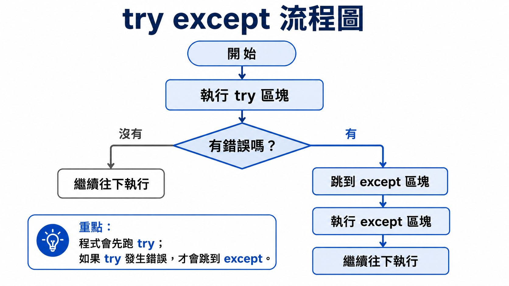
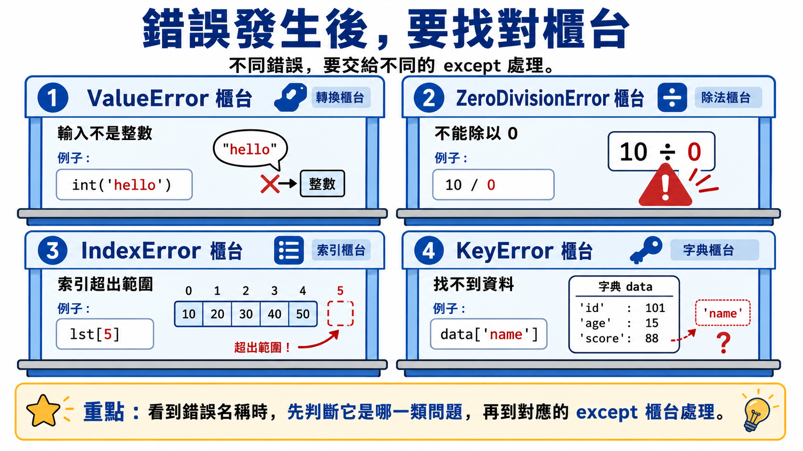
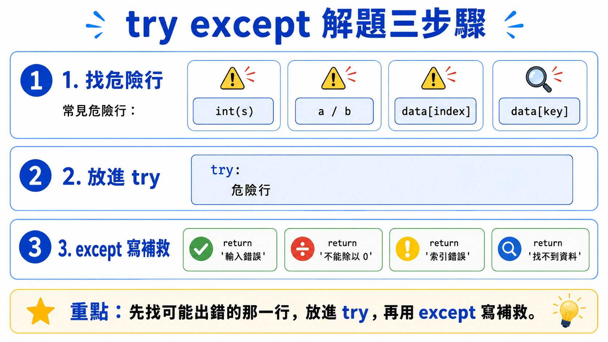

# Lesson 12 意外處理 Try & Except

寫程式時，我們常常希望使用者輸入正確的資料，例如整數、分數或選項。

但是在真實情況中，使用者可能會輸入意外的內容，
例如輸入文字、空白、錯誤格式，或是在程式執行中按下中斷鍵。

如果程式沒有處理這些情況，就可能直接出現錯誤並停止執行。

> 這堂課的重點：讓程式遇到錯誤時不要直接當掉，而是用指定方式處理錯誤。
> 

### 本課口號

```
先 try，後 except；
程式不怕錯，錯了有對策！
```

```
可能出錯，集中進 try！
發生錯誤，立刻 except！
錯誤分類，精準處理！
程式穩定，人人受益！
```

---

## Section I. 今天要做什麼？

1. 認識什麼是意外處理。
2. 理解為什麼程式可能會因為輸入錯誤而中止。
3. 學會基本的 `try` 和 `except` 寫法。
4. 認識常見錯誤類別，例如 `ValueError`、`TypeError`、`ZeroDivisionError`。
5. 學會針對不同錯誤寫不同的處理方式。
6. 練習閱讀含有 `try except` 的程式。
7. 完成幾題意外處理實作練習。

---

## Section II. 今天的學習方式

1. 看得懂 `try` 和 `except` 的基本結構。
2. 知道哪一段程式可能會出錯。
3. 知道錯誤發生後，程式會跳到 `except` 區塊。
4. 可以用 `ValueError` 處理常見的輸入轉型錯誤。
5. 寫題目時，能讓程式在輸入錯誤時輸出指定訊息。

---

## Section III. 今天會學到的內容

| 主題 | 你需要知道的事 |
| --- | --- |
| 意外處理 | 預防程式因為錯誤直接停止 |
| `try` | 放可能會出錯的程式區塊 |
| `except` | 放錯誤發生後要執行的處理方式 |
| 錯誤類別 | 不同錯誤有不同名稱，例如 `ValueError` |
| 多個 `except` | 可以針對不同錯誤做不同處理 |
| 不建議裸 `except` | 初學可以看懂，但實務上建議寫明錯誤類別 |

---

## Section IV. 寫題目前的提醒

### 1. 使用者輸入不一定符合預期

例如我們希望使用者輸入整數：

```python
x = input('請輸入整數：')
print(int(x) + 1)
```

如果使用者輸入：

```
hello
```

程式會出錯，因為 `hello` 不能轉成整數。

---

### 2. 錯誤不是一定要讓程式停止

我們可以告訴 Python：

```
如果這段程式出錯，就改做另一件事。
```

這就是 `try except` 的用途。

---

### 3. 不同錯誤要用不同方式處理

例如：

- 輸入 `hello` 不能轉成整數，通常是 `ValueError`。
- 除以 `0`，通常是 `ZeroDivisionError`。
- 使用不存在的變數，通常是 `NameError`。

---

## Section V. 核心概念說明

### 1. 什麼是意外處理？

意外處理 Exception Handling 是指：

```
當程式遇到錯誤時，不是直接停止，而是執行我們安排好的處理方式。
```

沒有意外處理時：

```python
x = input('請輸入整數：')
print(int(x) + 1)
```

如果輸入不是整數，程式會直接出錯並停止。

有意外處理時：

```python
try:
    x = input('請輸入整數：')
    print(int(x) + 1)
except ValueError:
    print('錯誤！輸入的不是整數！')
```

如果輸入不是整數，程式不會直接當掉，而是輸出：

```
錯誤！輸入的不是整數！
```

---

### 2. `try` 和 `except` 的基本結構



```python
try:
    # 可能會出錯的程式
    pass
except 錯誤類別:
    # 出錯時要做的事
    pass
```

說明：

| 區塊 | 功能 |
| --- | --- |
| `try` | 放可能會出錯的程式 |
| `except` | 放發生錯誤後要執行的程式 |

---

### 小口訣：先試試，錯了再處理

```
try：先試試看
except：錯了怎麼辦
```

也可以想成：

```
危險程式放 try 裡，
錯誤處理寫 except 裡！
```

---

### 3. 基本範例：輸入整數後加 1

.png)

```python
try:
    x = input('請輸入整數：')
    print(int(x) + 1)
except ValueError:
    print('錯誤！輸入的不是整數！')
```

如果輸入：

```
5
```

輸出：

```
6
```

如果輸入：

```
hello
```

輸出：

```
錯誤！輸入的不是整數！
```

---

### 4. 為什麼這裡用 `ValueError`？

這段程式中最容易出錯的是：

```python
int(x)
```

如果 `x` 是：

```python
'123'
```

可以成功轉成整數。

但如果 `x` 是：

```python
'hello'
```

就不能轉成整數，這種「值不適合轉換」的錯誤通常是 `ValueError`。

---

### 小口訣：值不合，ValueError

```
值不能轉，ValueError 來管！
輸入亂來不要怕，ValueError 接住它！
```

例如：

```python
int('123')      # 可以
int('hello')    # ValueError
```

---

### 5. 常見錯誤類別

.png)

| 錯誤類別 | 說明 | 常見例子 |
| --- | --- | --- |
| `NameError` | 使用沒有被定義的變數或名稱 | `print(x)`，但前面沒有設定 `x` |
| `IndexError` | 索引值超過序列範圍 | `a[5]`，但串列只有 3 個元素 |
| `TypeError` | 資料型態使用錯誤 | `'hi' + 3` |
| `SyntaxError` | Python 語法錯誤 | 少冒號、括號沒關好 |
| `ValueError` | 值的內容不適合目前操作 | `int('hello')` |
| `KeyboardInterrupt` | 手動中止程式 | 執行時按下中斷鍵 |
| `AssertionError` | `assert` 後面的條件不成立 | `assert x > 0` 但 `x` 是 `-1` |
| `KeyError` | 字典找不到指定的 key | `d['name']`，但沒有 `'name'` |
| `ZeroDivisionError` | 除以 0 | `10 / 0` |
| `AttributeError` | 使用不存在的屬性或方法 | 對錯誤物件使用某方法 |
| `IndentationError` | 縮排錯誤 | 該縮排的地方沒有縮排 |
| `IOError` | 輸入或輸出相關錯誤 | 讀檔、寫檔時發生問題 |
| `UnboundLocalError` | 區域變數使用順序或範圍錯誤 | 函式內變數尚未賦值就使用 |

---

### 6. 多個 `except`

如果我們想針對不同錯誤做不同處理，可以寫多個 `except`。



```python
try:
    a = int(input('請輸入第一個整數：'))
    b = int(input('請輸入第二個整數：'))
    print(a / b)
except ValueError:
    print('錯誤！請輸入整數！')
except ZeroDivisionError:
    print('錯誤！不能除以 0！')
```

如果輸入的不是整數，會執行 `ValueError` 的處理。

如果第二個數字是 `0`，會執行 `ZeroDivisionError` 的處理。

---

### 小口訣：錯誤找名字，找到才處理

多個 `except` 可以想成不同的櫃台：

```
ValueError 櫃台：處理輸入轉型錯誤
ZeroDivisionError 櫃台：處理除以 0
IndexError 櫃台：處理索引超出範圍
KeyError 櫃台：處理字典找不到 key
```

記住：

```
錯誤類別對得上，except 才會執行。
錯誤類別對不上，就不會被那個 except 處理。
```

---

### 7. 裸 `except` 是什麼？

有時會看到這種寫法：

```python
try:
    x = int(input('請輸入整數：'))
    print(x + 1)
except:
    print('發生錯誤！')
```

這種 `except` 後面沒有寫錯誤類別，代表幾乎所有錯誤都會被接住。

初學時可以先看懂，但實務上比較建議寫明錯誤類別：

```python
except ValueError:
    print('錯誤！輸入的不是整數！')
```

原因是：如果所有錯誤都被同一個 `except` 接住，有時候會不容易發現真正的問題。

---

## Section VI. 快速概念檢查

請先不要急著執行，先用眼睛看，猜猜看結果。

### Q1. 正確輸入整數

```python
try:
    x = int('5')
    print(x + 1)
except ValueError:
    print('輸入錯誤')
```

Question: 你覺得結果會是什麼？

Answer:

```
6
```

Explanation: `'5'` 可以轉成整數，所以不會進入 `except`。

---

### Q2. 錯誤輸入文字

```python
try:
    x = int('hello')
    print(x + 1)
except ValueError:
    print('輸入錯誤')
```

Question: 你覺得結果會是什麼？

Answer:

```
輸入錯誤
```

Explanation: `'hello'` 不能轉成整數，所以會進入 `except ValueError`。

---

### Q3. 除以 0

```python
try:
    print(10 / 0)
except ZeroDivisionError:
    print('不能除以 0')
```

Question: 你覺得結果會是什麼？

Answer:

```
不能除以 0
```

Explanation: `10 / 0` 會造成 `ZeroDivisionError`。

---

### Q4. 沒有發生錯誤

```python
try:
    print('Hello')
except ValueError:
    print('錯誤')
```

Question: 你覺得結果會是什麼？

Answer:

```
Hello
```

Explanation: `try` 裡沒有出錯，所以不會執行 `except`。

---

### Q5. 錯誤類別不符合

```python
try:
    print(10 / 0)
except ValueError:
    print('輸入錯誤')
```

Question: 這段程式會印出 `輸入錯誤` 嗎？

Answer:

```
不會
```

Explanation: `10 / 0` 是 `ZeroDivisionError`，不是 `ValueError`。因為錯誤類別不符合，所以這個 `except ValueError` 不會處理它。

---

## Section VII. 程式閱讀練習

### 題目 1：觀察輸入轉型

```python
try:
    x = int('20')
    print(x * 2)
except ValueError:
    print('不是整數')
```

思考方式：

```
'20' 可以轉成整數 20。
所以 print(x * 2) 會執行。
```

所以答案是：

```
40
```

---

### 題目 2：觀察 ValueError

```python
try:
    x = int('abc')
    print(x * 2)
except ValueError:
    print('不是整數')
```

思考方式：

```
'abc' 不能轉成整數。
所以程式會跳到 except ValueError。
```

所以答案是：

```
不是整數
```

---

### 題目 3：觀察多個 except

```python
try:
    a = int('10')
    b = int('0')
    print(a / b)
except ValueError:
    print('請輸入整數')
except ZeroDivisionError:
    print('不能除以 0')
```

思考方式：

```
'10' 和 '0' 都可以轉成整數。
但是 a / b 變成 10 / 0。
除以 0 會造成 ZeroDivisionError。
```

所以答案是：

```
不能除以 0
```

---

## Section VIII. 實作練習 / 實作檢測題

請完成下面的函式。這些題目主要練習「用 `try except` 讓程式可以處理錯誤」。

提醒：這一區請使用 `return`，不要使用 `print()`。

---

### Q1. 安全轉整數

完成函式：

```python
def q1_safe_int(s):
    #TODO: 如果 s 可以轉成整數，回傳 int(s)
    # 如果不能轉成整數，回傳 '輸入錯誤'
    return None
```

範例：

```python
q1_safe_int('123')
```

應該回傳：

```
123
```

範例：

```python
q1_safe_int('hello')
```

應該回傳：

```
輸入錯誤
```

---

### Q2. 安全加一

完成函式：

```python
def q2_safe_add_one(s):
    #TODO: 如果 s 可以轉成整數，回傳 int(s) + 1
    # 如果不能轉成整數，回傳 '不是整數'
    return None
```

範例：

```python
q2_safe_add_one('8')
```

應該回傳：

```
9
```

範例：

```python
q2_safe_add_one('abc')
```

應該回傳：

```
不是整數
```

---

### Q3. 安全除法

完成函式：

```python
def q3_safe_divide(a, b):
    #TODO: 回傳 a / b
    # 如果 b 是 0，回傳 '不能除以 0'
    return None
```

範例：

```python
q3_safe_divide(10, 2)
```

應該回傳：

```
5.0
```

範例：

```python
q3_safe_divide(10, 0)
```

應該回傳：

```
不能除以 0
```

---

### Q4. 取出串列元素

完成函式：

```python
def q4_safe_get(data, index):
    #TODO: 回傳 data[index]
    # 如果 index 超出範圍，回傳 '索引錯誤'
    return None
```

範例：

```python
q4_safe_get([10, 20, 30], 1)
```

應該回傳：

```
20
```

範例：

```python
q4_safe_get([10, 20, 30], 5)
```

應該回傳：

```
索引錯誤
```

---

### Q5. 安全取得字典資料

完成函式：

```python
def q5_safe_dict_get(data, key):
    #TODO: 回傳 data[key]
    # 如果 key 不存在，回傳 '找不到資料'
    return None
```

範例：

```python
q5_safe_dict_get({'name': 'Amy', 'score': 90}, 'name')
```

應該回傳：

```
Amy
```

範例：

```python
q5_safe_dict_get({'name': 'Amy', 'score': 90}, 'age')
```

應該回傳：

```
找不到資料
```

---

### Q6. 轉成整數後相加

完成函式：

```python
def q6_safe_sum(a, b):
    #TODO: 將 a 和 b 轉成整數後相加
    # 如果其中一個不能轉成整數，回傳 '輸入錯誤'
    return None
```

範例：

```python
q6_safe_sum('3', '5')
```

應該回傳：

```
8
```

範例：

```python
q6_safe_sum('3', 'hi')
```

應該回傳：

```
輸入錯誤
```

---

### Q7. 分數判斷

完成函式：

```python
def q7_safe_pass(score):
    #TODO: 將 score 轉成整數
    # 如果分數 >= 60，回傳 True
    # 如果分數 < 60，回傳 False
    # 如果不能轉成整數，回傳 '分數錯誤'
    return None
```

範例：

```python
q7_safe_pass('80')
```

應該回傳：

```
True
```

範例：

```python
q7_safe_pass('abc')
```

應該回傳：

```
分數錯誤
```

---

### Q8. 安全平均

完成函式：

```python
def q8_safe_average(a, b):
    #TODO: 將 a 和 b 轉成整數後，回傳平均
    # 如果不能轉成整數，回傳 '輸入錯誤'
    return None
```

範例：

```python
q8_safe_average('80', '90')
```

應該回傳：

```
85.0
```

範例：

```python
q8_safe_average('80', 'hi')
```

應該回傳：

```
輸入錯誤
```

---

### Q9. 安全 BMI 計算

完成函式：

```python
def q9_safe_bmi(weight, height):
    # weight 是公斤，height 是公尺
    #TODO: 將 weight 和 height 轉成 float 後計算 BMI
    # BMI = weight / (height ** 2)
    # 如果不能轉成數字，回傳 '輸入錯誤'
    # 如果 height 是 0，回傳 '身高不能是 0'
    return None
```

範例：

```python
q9_safe_bmi('60', '1.5')
```

應該回傳：

```
26.666666666666668
```

範例：

```python
q9_safe_bmi('60', '0')
```

應該回傳：

```
身高不能是 0
```

---

### Q10. 綜合練習：安全計算機

完成函式：

```python
def q10_safe_calculator(a, b, op):
    #TODO: 將 a 和 b 轉成整數
    # op 如果是 '+'，回傳 a + b
    # op 如果是 '-'，回傳 a - b
    # op 如果是 '*'，回傳 a * b
    # op 如果是 '/'，回傳 a / b
    # 如果不能轉成整數，回傳 '輸入錯誤'
    # 如果除以 0，回傳 '不能除以 0'
    # 如果 op 不是以上四種，回傳 '運算符號錯誤'
    return None
```

範例：

```python
q10_safe_calculator('10', '2', '+')
```

應該回傳：

```
12
```

範例：

```python
q10_safe_calculator('10', '0', '/')
```

應該回傳：

```
不能除以 0
```

範例：

```python
q10_safe_calculator('10', '2', '%')
```

應該回傳：

```
運算符號錯誤
```

---

## Section IX. 做題時可以使用的提示



### 解題口號：先抓危險，再寫補救

寫 `try except` 題目時，可以照這三步：

```
第一步：找出哪一行可能出錯。
第二步：把危險行放進 try。
第三步：在 except 寫錯誤時要回傳什麼。
```

常見危險行：

```python
int(s)          # 可能 ValueError
a / b           # 可能 ZeroDivisionError
data[index]     # 可能 IndexError
data[key]       # 可能 KeyError
```

口號版：

```
危險先集中，錯誤再分工；
類別寫清楚，程式才穩固！
```

---

### 1. 使用 `try except` 處理轉型錯誤

```python
try:
    x = int(s)
except ValueError:
    return '輸入錯誤'
```

---

### 2. 使用 `ZeroDivisionError` 處理除以 0

```python
try:
    result = a / b
except ZeroDivisionError:
    return '不能除以 0'
```

---

### 3. 使用 `IndexError` 處理索引超出範圍

```python
try:
    return data[index]
except IndexError:
    return '索引錯誤'
```

---

### 4. 使用 `KeyError` 處理字典 key 不存在

```python
try:
    return data[key]
except KeyError:
    return '找不到資料'
```

---

### 5. 多個錯誤可以分開寫

```python
try:
    a = int(a)
    b = int(b)
    return a / b
except ValueError:
    return '輸入錯誤'
except ZeroDivisionError:
    return '不能除以 0'
```

---

## Section X. 課後小練習

### 練習 1：安全年齡輸入

寫一個函式：

```python
def practice_age(age):
    return None
```

要求：

- 如果 `age` 可以轉成整數，回傳該整數。
- 如果不能轉成整數，回傳 `'年齡錯誤'`。

範例：

```python
practice_age('15')
```

應該回傳：

```
15
```

---

### 練習 2：安全價格計算

寫一個函式：

```python
def practice_total(price, count):
    return None
```

要求：

- 將 `price` 和 `count` 轉成整數後相乘。
- 如果不能轉成整數，回傳 `'資料錯誤'`。

範例：

```python
practice_total('30', '4')
```

應該回傳：

```
120
```

---

### 練習 3：安全取得第一個元素

寫一個函式：

```python
def practice_first(data):
    return None
```

要求：

- 回傳 `data[0]`。
- 如果串列是空的，回傳 `'沒有資料'`。

範例：

```python
practice_first([5, 6, 7])
```

應該回傳：

```
5
```

範例：

```python
practice_first([])
```

應該回傳：

```
沒有資料
```

---

### 練習 4：安全成績格式

寫一個函式：

```python
def practice_score_format(name, score):
    return None
```

要求：

- 將 `score` 轉成整數。
- 如果成功，回傳 `'name: score'` 的格式。
- 如果不能轉成整數，回傳 `'分數錯誤'`。

範例：

```python
practice_score_format('Amy', '90')
```

應該回傳：

```
Amy: 90
```

---

## Section XI. 重點複習

| 重點 | 說明 |
| --- | --- |
| 意外處理 | 讓程式遇到錯誤時可以改做指定處理 |
| `try` | 放可能會出錯的程式 |
| `except` | 放錯誤發生後要執行的程式 |
| `ValueError` | 常見於轉型失敗，例如 `int('hello')` |
| `ZeroDivisionError` | 除以 0 時發生 |
| `IndexError` | 索引超出範圍時發生 |
| `KeyError` | 字典找不到指定 key 時發生 |
| 多個 `except` | 可以針對不同錯誤做不同處理 |
| 裸 `except` | 不寫錯誤類別，初學可看懂，但實務上不建議常用 |

---

## Section XII. 常見錯誤提醒

### 1. 忘記冒號

錯誤寫法：

```python
try
    x = int(input())
except ValueError:
    print('錯誤')
```

正確寫法：

```python
try:
    x = int(input())
except ValueError:
    print('錯誤')
```

---

### 2. 忘記縮排

錯誤寫法：

```python
try:
x = int(input())
except ValueError:
print('錯誤')
```

正確寫法：

```python
try:
    x = int(input())
except ValueError:
    print('錯誤')
```

---

### 3. 字串忘記關閉引號

錯誤寫法：

```python
print('錯誤！輸入的不是整數!)
```

正確寫法：

```python
print('錯誤！輸入的不是整數！')
```

---

### 4. `except` 後面忘記冒號

錯誤寫法：

```python
except ValueError
    print('錯誤')
```

正確寫法：

```python
except ValueError:
    print('錯誤')
```

---

### 5. 錯誤類別寫錯

錯誤寫法：

```python
try:
    x = int('hello')
except TypeError:
    print('輸入錯誤')
```

這裡 `int('hello')` 主要會造成 `ValueError`，不是 `TypeError`。

較適合的寫法：

```python
try:
    x = int('hello')
except ValueError:
    print('輸入錯誤')
```

---

## Section XIII. 小結

`try except` 的核心想法是：

```
先嘗試執行可能會出錯的程式。
如果真的出錯，就執行我們準備好的處理方式。
```

初學時可以先記住：

```python
try:
    # 可能出錯
except ValueError:
    # 輸入或轉型錯誤時執行
```

在做程式題時，最常見的情境是：

```
使用者輸入文字 → 程式想轉成數字 → 轉型失敗 → 用 except 處理
```

最後再記一次：

```
一試：try 裡放危險。
二接：except 接錯誤。
三分：錯誤類別要分清。
四穩：程式錯了也不停。
```