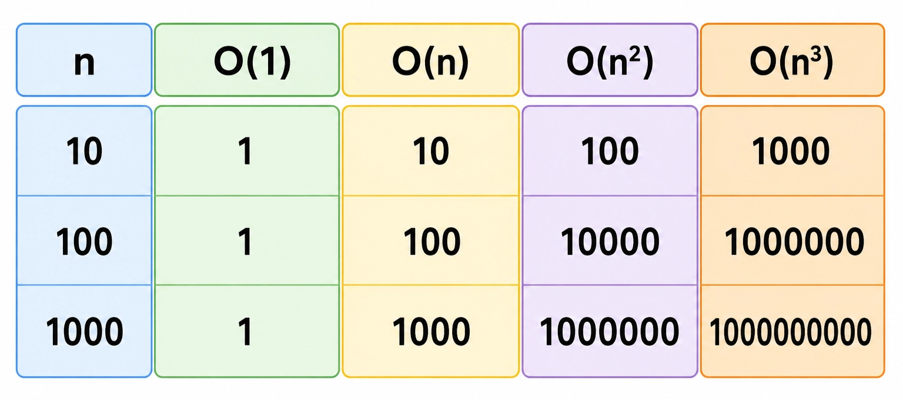

# Lesson 3：時間複雜度 Time Complexity

> 這堂課的重點：理解程式執行時間會受到資料量影響，並學會用 Big-O 表示大概的執行次數成長。
> 

---

## Section I. 今天要做什麼？

1. 認識什麼是時間複雜度。
2. 理解為什麼同一題可以有快方法和慢方法。
3. 學會判斷單層迴圈的複雜度。
4. 學會判斷巢狀迴圈的複雜度。
5. 知道 Big-O 會忽略常數。
6. 認識常見的複雜度。
7. 練習分析程式碼的執行次數。
8. 用 ZeroJudge 題目練習複雜度分析。

---

## Section II. 今天的學習方式

<p align="center">
  
</p>

時間複雜度一開始看起來像數學，但其實可以先把它想成：

> 程式大概要做幾次工作？
> 

如果程式做的事情越多，通常執行時間就會越久。

生活例子：

從 A 點走到 B 點，有很多不同路線。

有些路線很短，有些路線很長。

如果走路速度一樣，路線越短，通常越快到達。

程式也是一樣。

同一題可能有不同寫法。

有些寫法做的事情少，跑得比較快。

有些寫法做的事情多，跑得比較慢。

---

## Section III. 今天會學到的內容

| 主題 | 你需要知道的事 |
| --- | --- |
| 時間複雜度 | 用來估計程式執行時大概要做多少工作 |
| Big-O | 用來表示執行次數的成長速度 |
| `O(1)` | 執行次數幾乎固定 |
| `O(n)` | 執行次數和資料量成正比 |
| `O(n^2)` | 通常來自兩層巢狀迴圈 |
| `O(log n)` | 每次都把範圍縮小，例如二分搜尋 |
| `O(n log n)` | 常出現在較有效率的排序，例如合併排序 |
| 常數省略 | `O(3n)` 會寫成 `O(n)` |

---

## Section IV. 什麼是複雜度？

複雜度可以想像成：

> 程式執行時，需要做多少次工作。
> 

例如：

```python
for i in range(10):
    print(i)
```

這段程式會印出 10 次。

所以它做了大約 10 次工作。

如果資料量變成 `n`：

```python
for i in range(n):
    print(i)
```

這段程式會執行 `n` 次。

所以我們會說它的時間複雜度是：

```
O(n)
```

意思是：

> 當資料量變大時，執行次數大約跟著 n 一起變大。
> 

---

## Section V. 單層迴圈

<p align="center">
  
</p>

### 1. 固定次數

```python
for i in range(10):
    print(i)
```

這段程式執行 10 次。

因為 10 是固定的，不會隨著資料量變大。

如果只看 Big-O，可以視為：

```
O(1)
```

但是在很多入門題目中，我們更常看到變數控制迴圈次數。

---

### 2. 跟 n 有關的次數

```python
for i in range(n):
    print(i)
```

這段程式執行 `n` 次。

所以時間複雜度是：

```
O(n)
```

生活化理解：

如果有 `n` 張考卷要批改，一張一張看，就大約要做 `n` 次。

---

## Section VI. 巢狀迴圈

<p align="center">
  
</p>

巢狀迴圈就是迴圈裡面還有迴圈。

例如：

```python
for i in range(n):
    for j in range(n):
        print(j)
```

外層迴圈執行 `n` 次。

每一次外層迴圈中，內層迴圈又執行 `n` 次。

所以總次數是：

```
n * n = n^2
```

因此時間複雜度是：

```
O(n^2)
```

生活化理解：

如果班上有 `n` 個人，每個人都要跟其他 `n` 個人比一次資料，就會變成大約 `n^2` 次。

---

## Section VII. 常數可以省略

<p align="center">
  
</p>

請觀察下面的程式：

```python
for i in range(n):
    for j in range(3 * n):
        print(j)
```

外層迴圈執行 `n` 次。

內層迴圈執行 `3n` 次。

所以總次數是：

```
n * 3n = 3n^2
```

但是在 Big-O 裡面，通常不看常數。

所以：

```
O(3n^2) = O(n^2)
```

也就是說，這段程式的時間複雜度是：

```
O(n^2)
```

---

## Section VIII. 範例：複雜度計算

請計算以下程式碼的複雜度：

```python
for i in range(2 * n):
    for j in range(n ** 2):
        for k in range(n):
            pass
```

先看每一層迴圈：

第一層：

```
2n 次
```

第二層：

```
n^2 次
```

第三層：

```
n 次
```

所以總執行次數是：

```
2n * n^2 * n = 2n^4
```

Big-O 會省略常數，所以：

```
O(2n^4) = O(n^4)
```

答案：

```
O(n^4)
```

---

## Section IX. 常見時間複雜度

<p align="center">
  
</p>

### 1. `O(1)`：常數時間

執行次數幾乎不會因為資料量變大而改變。

常見例子：

```python
arr = [10, 20, 30]
print(arr[0])
```

這裡只是取出一個位置的資料。

所以可以想成固定時間。

---

### 2. `O(n)`：線性時間

常見例子：

```python
for i in range(n):
    print(i)
```

資料越多，做的事情越多。

如果 `n` 變成 2 倍，執行次數也大約變成 2 倍。

---

### 3. `O(n^2)`：平方時間

常見例子：

```python
for i in range(n):
    for j in range(n):
        print(i, j)
```

常見演算法：

- 選擇排序 Selection Sort
- 泡泡排序 Bubble Sort
- 插入排序 Insertion Sort

這種複雜度在資料量變大時會慢很多。

---

### 4. `O(n^3)`：立方時間

常見例子：

```python
for i in range(n):
    for j in range(n):
        for k in range(n):
            print(i, j, k)
```

三層巢狀迴圈常常會出現 `O(n^3)`。

---

### 5. `O(log n)`：對數時間

常見例子：

- 二分搜尋 Binary Search

二分搜尋的想法是：

> 每次都把範圍切一半。
> 

例如要在排序好的資料中找一個數字，不需要從頭到尾慢慢找。

每次看中間，就可以刪掉一半不可能的範圍。

---

### 6. `O(n log n)`

常見例子：

- 合併排序 Merge Sort
- 快速排序 Quick Sort 的平均情況

這類排序通常比 `O(n^2)` 的排序更適合大量資料。

---

### 7. `O(n^n)`

這是非常慢的複雜度。

當 `n` 稍微變大，執行次數就會快速增加。

寫程式時，如果遇到這種複雜度，通常要想想有沒有更好的方法。

---

## Section X. 寫題目前的提醒

### 1. 不一定要算得非常精準

複雜度不是要你算出程式剛好執行幾秒。

它主要是用來觀察：

> 當資料量變大時，程式會變慢多少？
> 

---

### 2. Big-O 通常看最大的項

例如：

```
O(n^2 + n + 5)
```

當 `n` 很大時，`n^2` 會比 `n` 和 `5` 重要很多。

所以通常寫成：

```
O(n^2)
```

---

### 3. 常數通常會省略

例如：

```
O(100n)
```

會寫成：

```
O(n)
```

因為 Big-O 主要看成長速度，不看固定倍數。

---

### 4. 看到巢狀迴圈，要先想每層跑幾次

例如：

```python
for i in range(n):
    for j in range(n):
        print(i, j)
```

可以想成：

```
外層 n 次
內層 n 次
總共 n * n = n^2 次
```

所以是：

```
O(n^2)
```

---

## Section XI. ZeroJudge 練習：e283 小崴的特殊編碼

### 題目描述

小崴要來玩編碼了。

這次，他打算跟你講很多字串。

這些字串都經過特殊編碼。

請你根據對照表，把編碼後的內容還原成原本的字串。

---

## 編碼方式

每個原始字串只會由 `A` 到 `F` 組成。

每個字元會被轉換成長度為 4 的二元序列。

對照表如下：

| 字元 | 編碼 |
| --- | --- |
| A | `0 1 0 1` |
| B | `0 1 1 1` |
| C | `0 0 1 0` |
| D | `1 1 0 1` |
| E | `1 0 0 0` |
| F | `1 1 0 0` |

---

## 輸入說明

多筆輸入，以 EOF 結束。

每筆輸入的第一行有一個正整數 `N`，代表此字串的長度。

接下來有 `N` 行。

每一行給一個字元經編碼後的序列。

---

## 輸出說明

每筆測資輸出一行原始字串。

---

## 範例輸入

```
1
0 1 0 1
1
0 0 1 0
2
1 0 0 0
1 1 0 0
4
1 1 0 1
1 0 0 0
0 1 1 1
1 1 0 1
```

## 範例輸出

```
A
C
EF
DEBD
```

---

## Section XII. 解題想法

這題可以使用字典。

字典可以幫我們做對照。

例如：

```python
code_table["0 1 0 1"]
```

會得到：

```
A
```

所以解題步驟是：

1. 先建立編碼對照表。
2. 讀取一筆測資的 `N`。
3. 接著讀取 `N` 行編碼。
4. 每讀到一行，就用字典查出對應字母。
5. 把字母接起來。
6. 輸出答案。

---

## Section XIII. 參考解答

```python
import sys

code_table = {
    "0 1 0 1": "A",
    "0 1 1 1": "B",
    "0 0 1 0": "C",
    "1 1 0 1": "D",
    "1 0 0 0": "E",
    "1 1 0 0": "F"
}

for line in sys.stdin:
    n = int(line)
    ans = ""

    for i in range(n):
        s = sys.stdin.readline().strip()
        ans += code_table[s]

    print(ans)
```

---

## Section XIV. 程式說明

### 1. 建立對照表

```python
code_table = {
    "0 1 0 1": "A",
    "0 1 1 1": "B",
    "0 0 1 0": "C",
    "1 1 0 1": "D",
    "1 0 0 0": "E",
    "1 1 0 0": "F"
}
```

這裡把編碼當成 key。

把原本的字母當成 value。

例如：

```
"0 1 0 1" 對應到 "A"
```

---

### 2. 讀取多筆輸入

```python
for line in sys.stdin:
    n = int(line)
```

題目說有多筆輸入，並且以 EOF 結束。

所以可以用：

```python
for line in sys.stdin:
```

一直讀到沒有資料為止。

---

### 3. 讀取 N 行編碼

```python
for i in range(n):
    s = sys.stdin.readline().strip()
```

每筆測資有 `N` 個字元。

所以這裡要讀取 `N` 行。

---

### 4. 查表並接上答案

```python
ans += code_table[s]
```

如果 `s` 是：

```
0 1 0 1
```

那麼：

```python
code_table[s]
```

會得到：

```
A
```

所以 `ans` 就會把 `A` 接上去。

---

## Section XV. 複雜度分析

假設每筆測資的字串長度是 `N`。

程式會讀取 `N` 行。

每一行都用字典查一次。

字典查詢通常可以視為：

```
O(1)
```

所以總時間複雜度是：

```
O(N)
```

空間複雜度方面，對照表只有 6 筆資料。

這是固定大小。

所以可以視為：

```
O(1)
```

---

## Section XVI. 常見錯誤

- 忘記題目是多筆輸入。
- 忘記用 EOF 結束，所以只讀一筆測資。
- 編碼中間有空格，所以 key 要寫成 `"0 1 0 1"` 這種形式。
- 忘記使用 `.strip()`，導致字串尾端有換行符號。
- 把 `n` 寫成大寫 `N`，但程式裡沒有定義。
- 輸出時多印了不必要的空白或空行。

---

## Section XVII. 重點複習

| 觀念 | 說明 |
| --- | --- |
| 時間複雜度 | 用來估計程式大概要做多少工作 |
| `O(n)` | 常見於單層迴圈 |
| `O(n^2)` | 常見於兩層巢狀迴圈 |
| 常數省略 | `O(3n)` 可以寫成 `O(n)` |
| 字典查詢 | 通常可以視為 `O(1)` |
| 多筆輸入 | 可以使用 `for line in sys.stdin` |
| EOF | 代表讀到檔案結尾 |

---

## Section XVIII. 課堂練習

### Q1. 判斷下面程式的時間複雜度：

```python
for i in range(n):
    print(i)
```

### Q2. 判斷下面程式的時間複雜度：

```python
for i in range(n):
    for j in range(n):
        print(i, j)
```

### Q3. 判斷下面程式的時間複雜度：

```python
for i in range(5 * n):
    print(i)
```

### Q4. 判斷下面程式的時間複雜度：

```python
for i in range(2 * n):
    for j in range(3 * n):
        print(i, j)
```

### Q5. 如果一段程式的執行次數是 `7n^2 + 3n + 10`，請問 Big-O 可以寫成什麼？

### Q6. 請說明為什麼 ZeroJudge e283 的參考解答時間複雜度是 `O(N)`。

---

## Section XIX. 課後練習

### 練習：自己做一個簡單解碼器

請建立一個字典：

```python
table = {
    "1": "A",
    "2": "B",
    "3": "C"
}
```

讓使用者輸入一個數字字串，例如：

```
1
```

程式輸出：

```
A
```

想一想：

如果輸入資料有很多行，程式的時間複雜度會是多少？

---