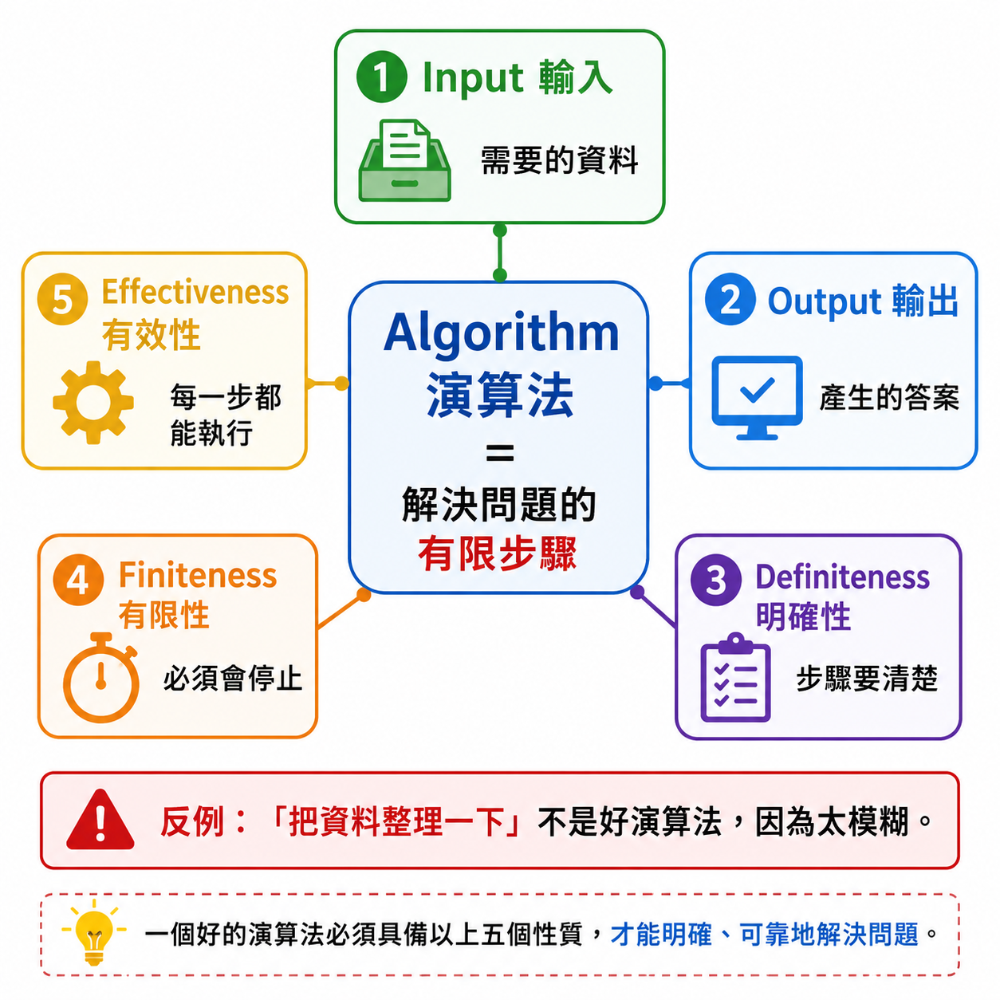
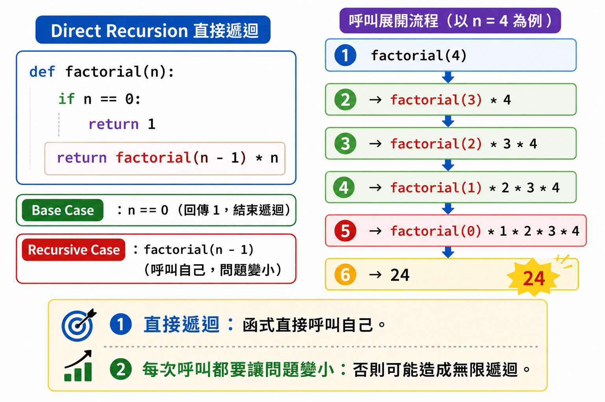
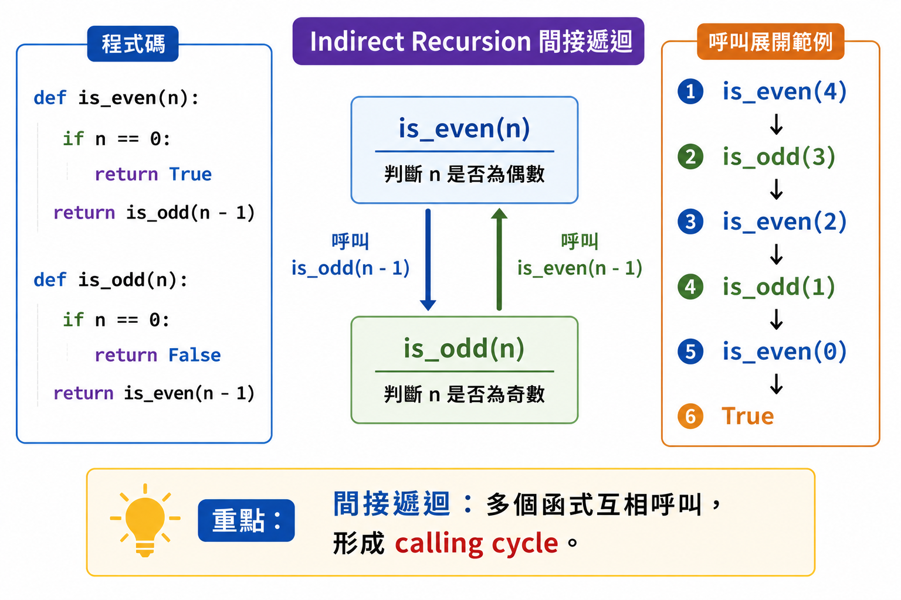
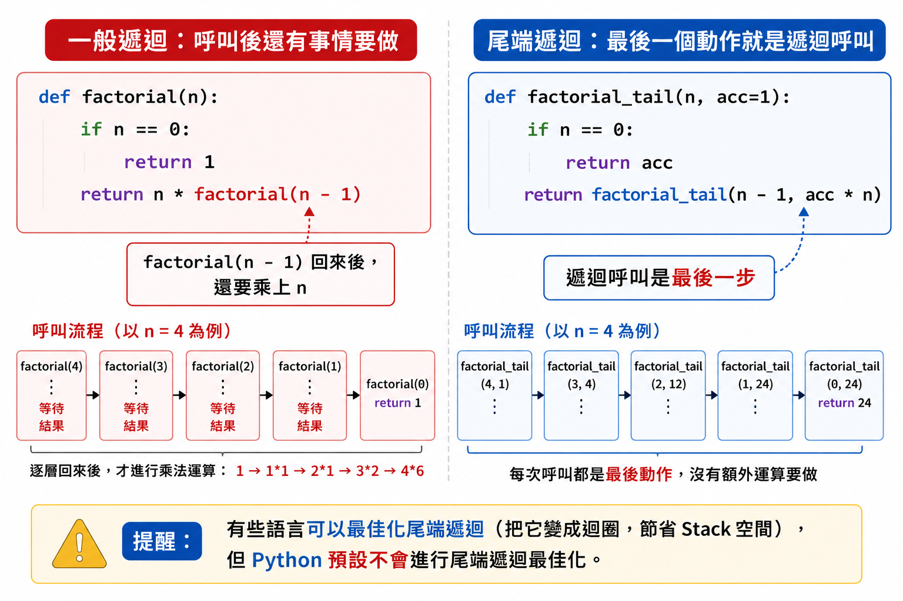
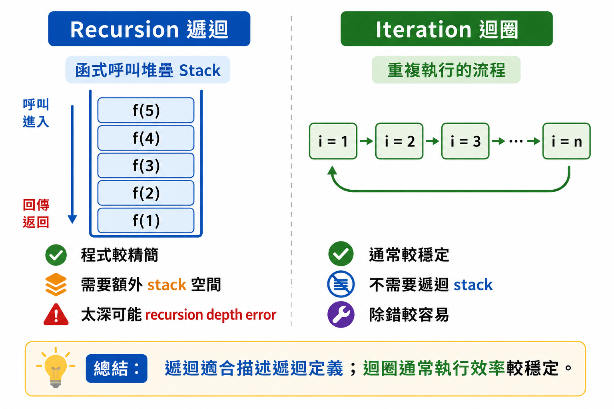
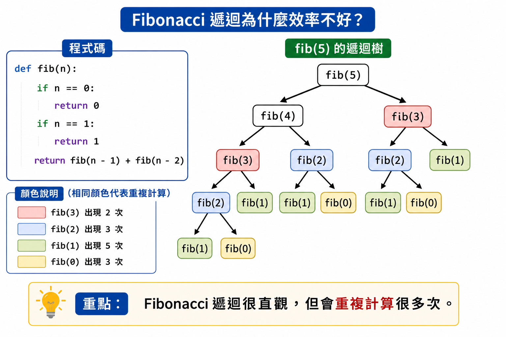
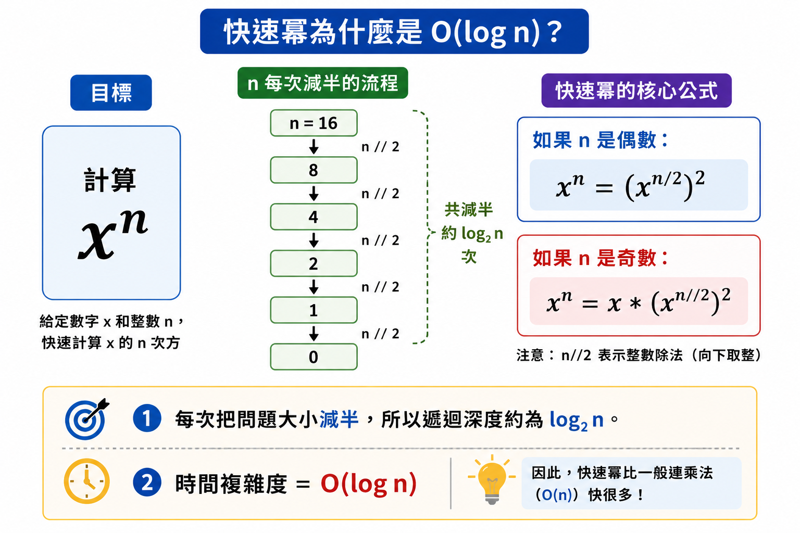
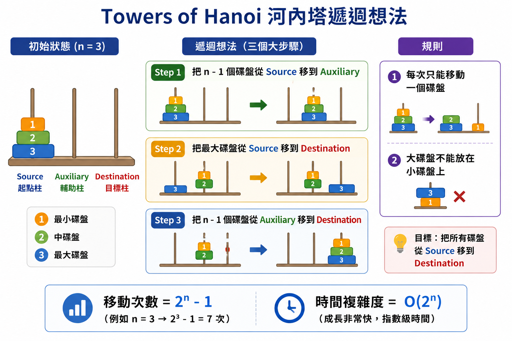
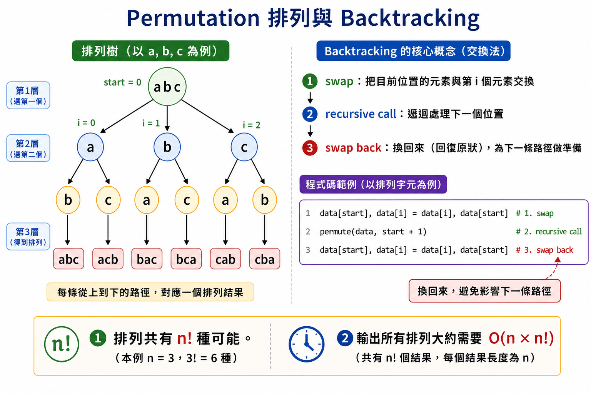
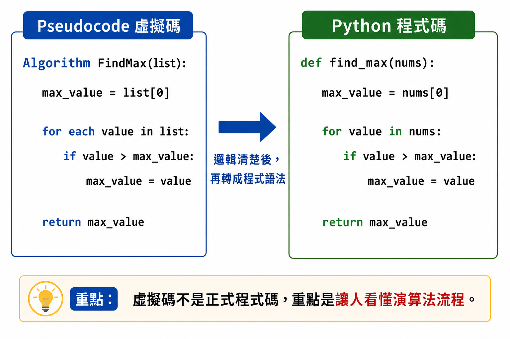

# Lesson 4：什麼是演算法？

> 這堂課的重點：理解演算法是解決問題的有限步驟，並學會用遞迴、迴圈與虛擬碼描述解題方法。
> 

---

## Section I. 今天要做什麼？

1. 認識什麼是演算法 Algorithm。
2. 理解演算法的五個重要性質。
3. 認識直接遞迴 Direct Recursion。
4. 認識間接遞迴 Indirect Recursion。
5. 認識尾端遞迴 Tail Recursion。
6. 比較 Recursion 和 Iteration。
7. 用遞迴寫常見數學問題。
8. 認識河內塔 Towers of Hanoi。
9. 認識排列 Permutation。
10. 認識虛擬碼 Pseudocode。

---

## Section II. 今天的學習方式

寫程式前，通常要先想：

> 我要用什麼步驟解決這個問題？
> 

這些步驟就是演算法。

演算法不一定一開始就要寫成真正的 Python 程式。

有時候可以先用中文、流程、虛擬碼來描述。

等想清楚之後，再轉成真正的程式碼。

---

# Session 1. 演算法定義 Algorithm

## 1. 什麼是演算法？

演算法是用來解決特定問題的：

> 有限個指令、敘述或方法。
> 

也就是說，演算法是一組清楚的步驟。

例如：

要找出兩個數字中比較大的數字，可以這樣想：

```
如果 a > b，答案是 a
否則，答案是 b
```

這就是一個簡單的演算法。

---

## 2. 演算法的五個性質

一個好的演算法通常要符合五個性質。

| 性質 | 英文 | 說明 |
| --- | --- | --- |
| 輸入 | Input | 演算法可以接受輸入資料 |
| 輸出 | Output | 演算法會產生輸出資料 |
| 明確性 | Definiteness | 每個步驟都要清楚，不可以模糊 |
| 有限性 | Finiteness | 執行有限步驟後必須停止 |
| 有效性 | Effectiveness | 每個步驟都要足夠基本，可以被執行 |

<p align="center">
  
</p>

---

## 3. Input 輸入

Input 是演算法需要的資料。

例如：

```python
def add(a, b):
    return a + b
```

這裡的 `a` 和 `b` 就是輸入。

---

## 4. Output 輸出

Output 是演算法執行後產生的結果。

例如：

```python
def add(a, b):
    return a + b
```

這裡的 `return a + b` 就是輸出。

---

## 5. Definiteness 明確性

明確性代表：

> 每一個步驟都要清楚，而且不能讓人誤會。
> 

例如下面這句不夠明確：

```
把資料處理一下。
```

因為「處理一下」太模糊。

比較好的寫法是：

```
把 list 裡面的每個數字加總。
```

這樣才清楚。

---

## 6. Finiteness 有限性

有限性代表：

> 演算法一定要在有限步驟後結束。
> 

例如：

```python
while True:
    print("Hello")
```

這段程式會一直跑下去。

如果沒有額外的停止條件，它就不是一個好的演算法。

---

## 7. Effectiveness 有效性

有效性代表：

> 每一個步驟都要足夠基本，可以真的被執行。
> 

例如：

```
直接算出宇宙中所有粒子的狀態。
```

這不是一個有效的演算法步驟。

因為這個指令太抽象，也無法實際用紙筆追蹤。

比較好的演算法，應該要把步驟拆得更清楚。

---

# Session 2. 遞迴 Recursion

## 1. 什麼是遞迴？

遞迴是指：

> 函式在執行過程中呼叫自己。
> 

遞迴通常會有兩個重要部分：

| 部分 | 說明 |
| --- | --- |
| Base Case | 終止條件，避免無限呼叫 |
| Recursive Case | 遞迴呼叫，把問題變小 |

---

## 2. Direct Recursion 直接遞迴

<p align="center">
  
</p>

直接遞迴是指：

> 一個 function 直接呼叫自己。
> 

例如階乘：

```python
def factorial(n: int) -> int:
    if n == 0:
        return 1

    return factorial(n - 1) * n
```

這裡 `factorial()` 在函式裡面呼叫了自己。

所以它是直接遞迴。

---

## 3. 直接遞迴的執行概念

例如：

```python
factorial(4)
```

大概會展開成：

```
factorial(4)
= factorial(3) * 4
= factorial(2) * 3 * 4
= factorial(1) * 2 * 3 * 4
= factorial(0) * 1 * 2 * 3 * 4
= 1 * 1 * 2 * 3 * 4
= 24
```

遞迴的重點是：

> 每一次呼叫都要讓問題變得更小，最後要碰到終止條件。
> 

---

## 4. Indirect Recursion 間接遞迴

<p align="center">
  
</p>

間接遞迴是指：

> 多個函式互相呼叫，形成 calling cycle。
> 

例如：

```python
def is_even(n):
    if n == 0:
        return True

    return is_odd(n - 1)

def is_odd(n):
    if n == 0:
        return False

    return is_even(n - 1)

print(is_even(4))  # True
print(is_odd(5))   # True
```

這裡：

```
is_even() 呼叫 is_odd()
is_odd() 呼叫 is_even()
```

所以是間接遞迴。

---

## 5. 為什麼實務上比較少用間接遞迴？

間接遞迴不是不能用，但是通常不建議初學者常用。

原因包括：

- 理解比較困難
- 除錯比較困難
- 效能可能比較差
- 很難看出停止條件是否正確
- 實務上很多問題可以用更清楚的方法處理

---

## 6. Tail Recursion 尾端遞迴

<p align="center">
  
</p>

尾端遞迴是直接遞迴的一種。

它的特色是：

> 遞迴呼叫是函式的最後一個動作。
> 

先看一個不是尾端遞迴的版本：

```python
def factorial(n):
    if n == 0:
        return 1

    return n * factorial(n - 1)
```

這裡遞迴呼叫完之後，還要再乘上 `n`。

所以遞迴呼叫不是最後一個動作。

---

## 7. 尾端遞迴版本

```python
def factorial_tail(n, acc=1):
    if n == 0:
        return acc

    return factorial_tail(n - 1, acc * n)

print(factorial_tail(5))  # 120
```

這裡最後一個動作就是：

```python
return factorial_tail(n - 1, acc * n)
```

所以它是尾端遞迴。

補充：

有些語言的 compiler 可以對尾端遞迴做最佳化。

但是 Python 預設不會做 Tail Recursion Optimization。

所以在 Python 裡，遞迴太深仍然可能遇到 recursion depth 的問題。

---

## 8. Recursion v.s. Iteration

<p align="center">
  
</p>

| Recursion 遞迴 | Iteration 迴圈 |
| --- | --- |
| 程式可能比較精簡 | 程式可能比較冗長 |
| 區域變數可能比較少 | 區域變數可能比較多 |
| 很適合表達遞迴定義的問題 | 有些問題表達起來比較不直覺 |
| 除錯較困難 | 除錯較簡單 |
| 執行時間可能較久 | 執行時間通常較短 |
| 需要額外 stack 空間 | 不需要遞迴 stack 空間 |
| 遞迴太深可能爆掉 | 通常比較穩定 |

---

## 9. 遞迴演算法的關鍵

寫遞迴時，最重要的是先找出數學定義。

通常要想三件事：

1. 最小問題是什麼？
2. 終止條件是什麼？
3. 大問題如何拆成小問題？

---

# Session 3. 常見 Recursion Algo

## 1. 階乘 Factorial

數學定義：

```
n! = 1,                    if n = 0
n! = n * (n - 1)!,          if n > 0
```

Python 程式：

```python
def factorial(n):
    if n == 0:
        return 1

    return factorial(n - 1) * n
```

例如：

```python
print(factorial(5))  # 120
```

---

## 2. Fibonacci Number 費氏數列

<p align="center">
  
</p>

數學定義：

```
Fib(0) = 0
Fib(1) = 1
Fib(n) = Fib(n - 1) + Fib(n - 2), if n >= 2
```

Python 程式：

```python
def fib(n):
    if n == 0:
        return 0
    elif n == 1:
        return 1

    return fib(n - 1) + fib(n - 2)
```

例如：

```python
print(fib(6))  # 8
```

小提醒：

這個寫法很直觀，但效率不好。

因為它會重複計算很多次。

---

## 3. Arithmetic Series 等差級數

等差數列第 `n` 項：

```
a_n = a_1 + (n - 1) * d
```

前 `n` 項和：

```
S_n = a_1 + a_2 + ... + a_n
```

遞迴想法：

```
S_n = S_(n - 1) + a_n
```

Python 程式：

```python
def arithmetic_sum(a1, n, d):
    if n == 0:
        return 0

    an = a1 + (n - 1) * d
    return arithmetic_sum(a1, n - 1, d) + an
```

例如：

```python
print(arithmetic_sum(1, 5, 1))  # 15
```

---

## 4. Binomial Coefficient 二項式係數

數學定義：

```
C(n, k) = 1,                              if k = 0 or k = n
C(n, k) = C(n - 1, k - 1) + C(n - 1, k),  if 0 < k < n
```

Python 程式：

```python
def binomial(n, k):
    if k == 0 or k == n:
        return 1

    return binomial(n - 1, k - 1) + binomial(n - 1, k)
```

例如：

```python
print(binomial(5, 2))  # 10
```

---

## 5. GCD 最大公因數

GCD 是 Greatest Common Divisor。

常見方法是：

> 輾轉相除法 Euclidean Algorithm
> 

數學想法：

```
gcd(a, b) = gcd(b, a % b)
```

直到餘數是 0。

Python 程式：

```python
def gcd(a, b):
    if b == 0:
        return a

    return gcd(b, a % b)
```

例如：

```python
print(gcd(12, 8))  # 4
```

---

## 6. Ackermann’s Function 艾克曼函數

Ackermann’s Function 是一個成長非常快的遞迴函數。

數學定義：

```
A(m, n) = n + 1,                      if m = 0
A(m, n) = A(m - 1, 1),                if m > 0 and n = 0
A(m, n) = A(m - 1, A(m, n - 1)),      if m > 0 and n > 0
```

Python 程式：

```python
def ackermann(m, n):
    if m == 0:
        return n + 1

    if m > 0 and n == 0:
        return ackermann(m - 1, 1)

    return ackermann(m - 1, ackermann(m, n - 1))
```

例如：

```python
print(ackermann(2, 2))  # 7
```

小提醒：

這個函數成長非常快，不適合拿太大的數字測試。

---

## 7. Exponent Function 指數函數：O(n) 版本

目標：

```
exp(x, n) = x^n
```

遞迴定義：

```
x^0 = 1
x^n = x^(n - 1) * x, if n > 0
```

Python 程式：

```python
def power_linear(x, n):
    if n == 0:
        return 1

    return power_linear(x, n - 1) * x
```

例如：

```python
print(power_linear(2, 5))  # 32
```

這個版本每次只把 `n` 減 1。

所以時間複雜度是：

```
O(n)
```

---

## 8. Exponent Function 指數函數：O(log n) 版本

<p align="center">
  
</p>

可以用快速冪來降低複雜度。

想法：

如果 `n` 是偶數：

```
x^n = (x^(n / 2))^2
```

如果 `n` 是奇數：

```
x^n = x * x^(n - 1)
```

Python 程式：

```python
def power_fast(x, n):
    if n == 0:
        return 1

    half = power_fast(x, n // 2)

    if n % 2 == 0:
        return half * half

    return x * half * half
```

例如：

```python
print(power_fast(2, 10))  # 1024
```

這個版本每次大約把 `n` 變成一半。

所以時間複雜度是：

```
O(log n)
```

---

# Session 4. Towers of Hanoi 河內塔

<p align="center">
  
</p>

## 1. 河內塔規則

河內塔有三根柱子：

| 名稱 | 意思 |
| --- | --- |
| Source | 起點柱 |
| Auxiliary | 輔助柱 |
| Destination | 目標柱 |

規則：

1. 每次只能移動一個碟盤。
2. 大碟盤不能放在小碟盤上。
3. 目標是把 Source 上所有碟盤移到 Destination。

---

## 2. 河內塔的遞迴想法

如果要把 `n` 個碟盤從 Source 搬到 Destination：

1. 先把上面的 `n - 1` 個碟盤從 Source 搬到 Auxiliary。
2. 把最大的第 `n` 個碟盤從 Source 搬到 Destination。
3. 再把 `n - 1` 個碟盤從 Auxiliary 搬到 Destination。

---

## 3. 河內塔範例：3 個碟盤

步驟：

```
move disk 1 from Source to Destination
move disk 2 from Source to Auxiliary
move disk 1 from Destination to Auxiliary
move disk 3 from Source to Destination
move disk 1 from Auxiliary to Source
move disk 2 from Auxiliary to Destination
move disk 1 from Source to Destination
```

總共需要 7 步。

---

## 4. 河內塔 Python 程式

```python
def hanoi(n, source, auxiliary, destination):
    if n == 1:
        print(f"move disk 1 from{source} to{destination}")
        return

    hanoi(n - 1, source, destination, auxiliary)
    print(f"move disk{n} from{source} to{destination}")
    hanoi(n - 1, auxiliary, source, destination)
```

測試：

```python
hanoi(3, "Source", "Auxiliary", "Destination")
```

輸出：

```
move disk 1 from Source to Destination
move disk 2 from Source to Auxiliary
move disk 1 from Destination to Auxiliary
move disk 3 from Source to Destination
move disk 1 from Auxiliary to Source
move disk 2 from Auxiliary to Destination
move disk 1 from Source to Destination
```

---

## 5. 河內塔複雜度

河內塔的移動次數是：

```
2^n - 1
```

所以時間複雜度是：

```
O(2^n)
```

---

# Session 5. Permutation 排列

<p align="center">
  
</p>

## 1. 什麼是排列？

如果有 `n` 個資料，要列出所有排列，總共有：

```
n!
```

種可能。

例如有三個字母：

```
a, b, c
```

所有排列是：

```
abc
acb
bac
bca
cab
cba
```

---

## 2. 排列的遞迴想法

以 `a, b, c` 為例：

先固定第一個位置。

如果第一個位置是 `a`：

```
a + Perm(b, c)
```

如果第一個位置是 `b`：

```
b + Perm(a, c)
```

如果第一個位置是 `c`：

```
c + Perm(a, b)
```

也就是：

> 每次選一個元素當開頭，剩下的元素繼續排列。
> 

---

## 3. Python 排列程式：交換法

```python
def permute(data, start=0):
    if start == len(data) - 1:
        print("".join(data))
        return

    for i in range(start, len(data)):
        data[start], data[i] = data[i], data[start]
        permute(data, start + 1)
        data[start], data[i] = data[i], data[start]
```

測試：

```python
letters = ["a", "b", "c"]
permute(letters)
```

輸出：

```
abc
acb
bac
bca
cba
cab
```

注意：

最後一次 swap 是為了把資料換回來。

這樣下一輪遞迴才不會受到前一次影響。

---

## 4. 排列複雜度

排列總共有：

```
n!
```

種。

如果每次輸出一個長度為 `n` 的排列，時間複雜度大約是：

```
O(n * n!)
```

如果只看排列數量，常會說是：

```
O(n!)
```

---

# Session 6. Pseudocode 虛擬碼

<p align="center">
  
</p>

## 1. 什麼是虛擬碼？

虛擬碼不是可以直接執行的程式碼。

它是用來描述演算法的方法。

虛擬碼沒有固定格式。

可以寫得像：

- C-like
- Python-like
- 中文步驟
- 表格流程

重點是：

> 讓人看得懂演算法在做什麼。
> 

---

## 2. 為什麼要用虛擬碼？

因為有時候直接寫程式會卡在語法。

虛擬碼可以幫助我們先想清楚邏輯。

等邏輯清楚後，再轉成 Python 程式。

---

## 3. 虛擬碼範例：找最大值

```
Algorithm FindMax(list):
    max_value = list[0]

    for each value in list:
        if value > max_value:
            max_value = value

    return max_value
```

轉成 Python：

```python
def find_max(nums):
    max_value = nums[0]

    for value in nums:
        if value > max_value:
            max_value = value

    return max_value
```

---

## 4. 虛擬碼範例：線性搜尋

```
Algorithm LinearSearch(list, target):
    for each value in list:
        if value == target:
            return True

    return False
```

轉成 Python：

```python
def linear_search(nums, target):
    for value in nums:
        if value == target:
            return True

    return False
```

---

# Section VII. 常見錯誤

- 把演算法想成一定要是某種程式語言。
- 忘記演算法必須在有限步驟後結束。
- 寫遞迴時沒有 Base Case。
- 遞迴呼叫時，問題沒有變小。
- 把尾端遞迴和一般遞迴混在一起。
- 以為 Python 會自動最佳化尾端遞迴。
- 寫河內塔時，三根柱子的順序傳錯。
- 寫排列時，忘記把 swap 換回來。
- 虛擬碼寫得太模糊，導致別人看不懂。

---

# Section VIII. 重點複習

| 觀念 | 說明 |
| --- | --- |
| Algorithm | 解決問題的有限步驟 |
| Input | 輸入資料 |
| Output | 輸出資料 |
| Definiteness | 每個步驟要清楚 |
| Finiteness | 必須在有限步驟後停止 |
| Effectiveness | 每個步驟要可以被執行 |
| Direct Recursion | 函式直接呼叫自己 |
| Indirect Recursion | 多個函式互相呼叫形成循環 |
| Tail Recursion | 遞迴呼叫是最後一個動作 |
| Iteration | 使用迴圈重複執行 |
| Pseudocode | 用來描述演算法的非正式程式碼 |

---

# Section IX. 課堂練習

## Q1. 演算法性質

請寫出演算法的五個性質。

---

## Q2. 判斷是否為演算法

下面的描述是否是一個好的演算法？

```
把資料整理一下，然後得到答案。
```

請說明原因。

---

## Q3. 直接遞迴

請判斷下面程式是否為直接遞迴：

```python
def f(n):
    if n == 0:
        return 0

    return f(n - 1) + 1
```

---

## Q4. 遞迴終止條件

下面程式有什麼問題？

```python
def f(n):
    return f(n - 1)
```

---

## Q5. 階乘

請用遞迴寫出 `factorial(n)`。

---

## Q6. Fibonacci

請用遞迴寫出 `fib(n)`。

---

## Q7. GCD

請用遞迴寫出 `gcd(a, b)`。

---

## Q8. 快速冪

請問為什麼快速冪 `power_fast(x, n)` 的時間複雜度是 `O(log n)`？

---

## Q9. 河內塔

如果河內塔有 3 個碟盤，總共需要移動幾次？

---

## Q10. 虛擬碼

請用虛擬碼描述「找出 list 中最小值」的演算法。

---

# Section X. 課後練習

## 練習一：把虛擬碼轉成 Python

虛擬碼：

```
Algorithm CountPositive(list):
    count = 0

    for each value in list:
        if value > 0:
            count = count + 1

    return count
```

請把它改寫成 Python 函式。

---

## 練習二：遞迴加總

請用遞迴寫一個函式：

```python
sum_to_n(n)
```

功能：

```
sum_to_n(5) = 1 + 2 + 3 + 4 + 5 = 15
```

---

## 練習三：排列

請使用 `permute()` 產生：

```
["A", "B", "C"]
```

的所有排列。

---