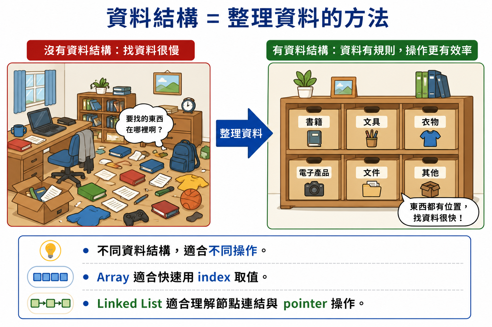
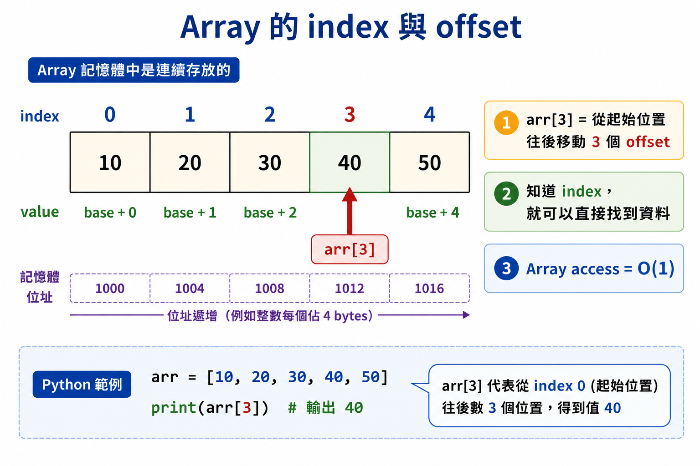
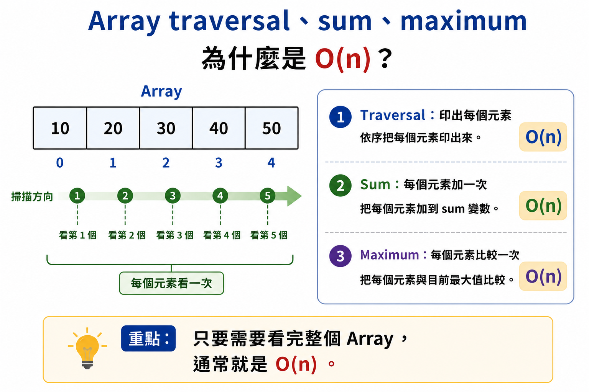
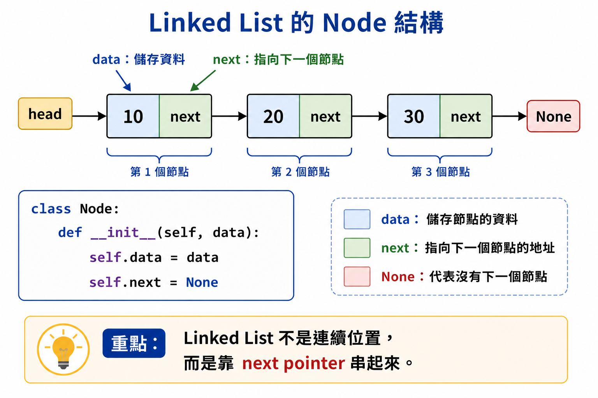
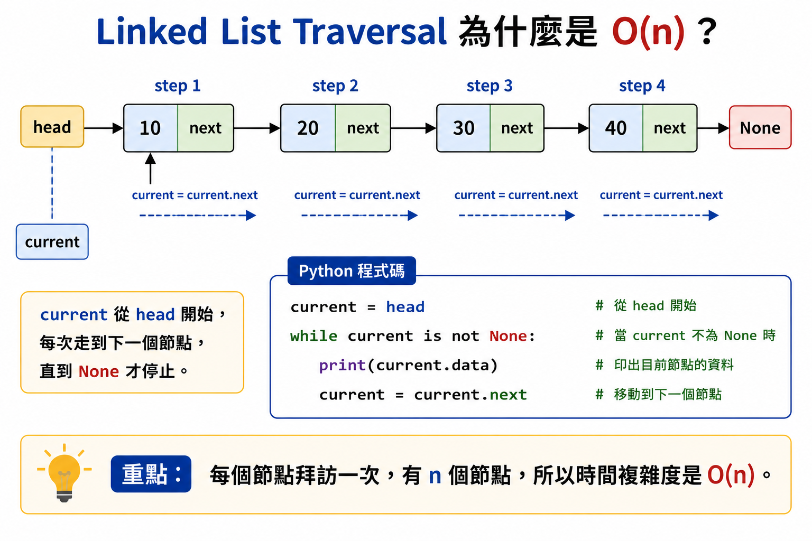
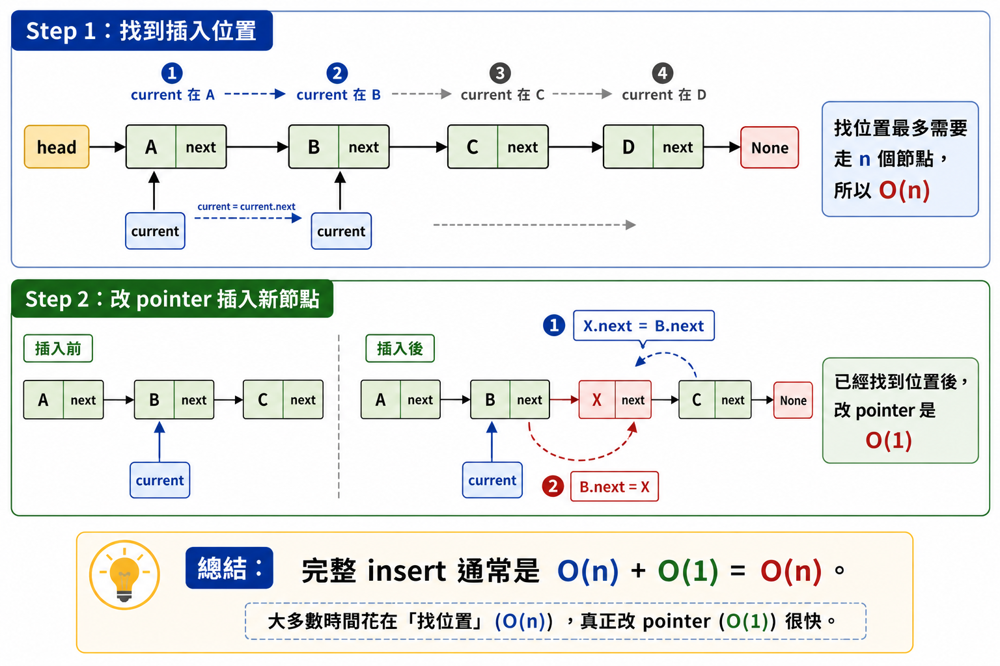
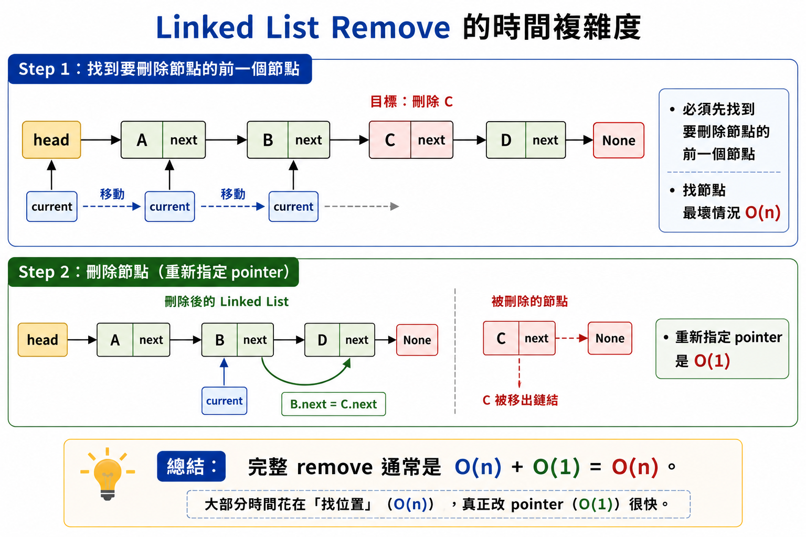
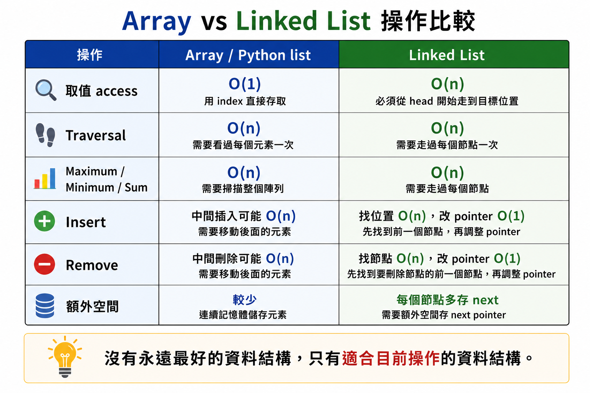
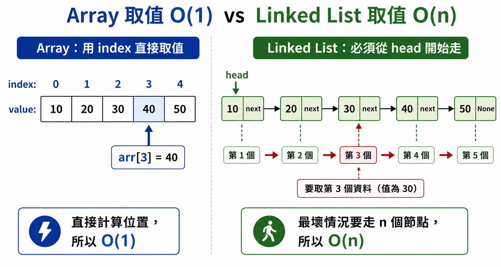
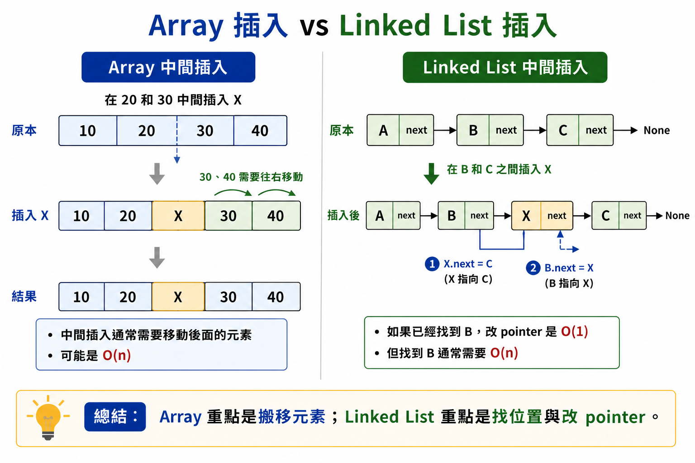

# Lesson 5：資料結構 - 陣列與鏈結串列

> 這堂課的重點：理解資料結構是「整理資料的方法」，並比較陣列 Array 和鏈結串列 Linked List 在取值、走訪、插入、刪除等操作上的差異。
> 

---

## Section I. 今天要做什麼？

1. 認識什麼是資料結構。
2. 理解為什麼資料要有結構地儲存。
3. 認識陣列 Array 的概念。
4. 學會分析陣列常見操作的時間複雜度。
5. 認識鏈結串列 Linked List 的概念。
6. 理解節點 Node、data、next pointer。
7. 學會分析鏈結串列常見操作的時間複雜度。
8. 比較 Array 和 Linked List 的差異。

---

## Section II. 今天的學習方式

資料結構可以想成：

> 資料的整理方式。
> 

就像整理房間一樣。

如果東西亂放，要找東西會很慢。

如果東西有分類、有位置、有規則，要找東西就會比較快。

電腦儲存資料也是一樣。

不同資料結構適合不同操作。

有些資料結構適合快速取值。

有些資料結構適合插入和刪除。

---

# Session 1. 什麼是資料結構？

資料結構 Data Structure 是一種儲存資料的方法。

<p align="center">
  
</p>

它會影響程式執行時的效率。

例如：

如果我們要儲存一群學生的成績，可以用：

```python
scores = [80, 90, 75, 88]
```

這就是使用 Python list 儲存多筆資料。

如果只是要依照位置取資料，list 很方便。

例如：

```python
print(scores[1])
```

會取得第 1 個 index 的資料，也就是：

```
90
```

---

## 為什麼要學資料結構？

因為同一個問題，使用不同資料結構，效率可能差很多。

例如：

| 想做的事情 | 適合的資料結構可能不同 |
| --- | --- |
| 快速用 index 取資料 | Array / Python list |
| 常常在中間插入資料 | Linked List 可能比較適合概念理解 |
| 快速查找 key 對應 value | Dictionary |
| 先進先出 | Queue |
| 後進先出 | Stack |

這一課先介紹兩種基礎資料結構：

1. Array 陣列
2. Linked List 鏈結串列

---

# Session 2. 陣列 Array

## 1. 什麼是陣列？

陣列 Array 可以一次儲存多筆資料。

可以把它想像成一排櫃子。

每個抽屜都有一個編號。

每個抽屜可以放一筆資料。

例如：

```
index:  0   1   2   3   4
value: 10  20  30  40  50
```

在 Python 中，我們通常用 list 來示範類似陣列的操作：

```python
arr = [10, 20, 30, 40, 50]
```

---

## 2. index 和 offset

在陣列中，每個元素都有位置。

這個位置通常叫做 index。

Python 的 index 從 0 開始。

<p align="center">
  
</p>

例如：

```python
arr = [10, 20, 30, 40, 50]

print(arr[0])  # 10
print(arr[1])  # 20
print(arr[4])  # 50
```

`arr[1]` 的意思是：

> 從起始位置往後移動 1 個 offset。
> 

所以可以快速找到資料。

---

## 3. Array 取值：O(1)

陣列最大的特色之一是：

> 可以用 index 直接取值。
> 

例如：

```python
arr = [10, 20, 30, 40, 50]

print(arr[3])
```

只要知道 index，就可以直接找到資料。

計算位置花費：

```
O(1)
```

取得資料花費：

```
O(1)
```

所以整體是：

```
O(1) + O(1) = O(1)
```

因此 Array 取值的時間複雜度是：

```
O(1)
```

---

## 4. Array Traversal 走訪：O(n)

Traversal 指的是：

> 從頭到尾掃描陣列一次。
> 

例如：

```python
arr = [10, 20, 30, 40, 50]

for value in arr:
    print(value)
```

如果陣列有 `n` 筆資料，就會拜訪 `n` 次。

每次取值可以視為：

```
O(1)
```

總共 `n` 次：

```
O(1) * n = O(n)
```

所以 Traversal 的時間複雜度是：

```
O(n)
```

---

## 5. Array Maximum 最大值：O(n)

Maximum 是找出陣列中的最大值。

想法：

1. 先假設第 0 項是最大值。
2. 從第 1 項開始往後檢查。
3. 如果遇到更大的值，就更新最大值。

Python 程式：

```python
def find_max(arr):
    max_value = arr[0]

    for i in range(1, len(arr)):
        if arr[i] > max_value:
            max_value = arr[i]

    return max_value
```

每次比較花費：

```
O(1)
```

總共大約比較 `n - 1` 次：

```
O(1) * (n - 1) = O(n)
```

所以時間複雜度是：

```
O(n)
```

---

## 6. Array Minimum 最小值：O(n)

Minimum 是找出陣列中的最小值。

想法：

1. 先假設第 0 項是最小值。
2. 從第 1 項開始往後檢查。
3. 如果遇到更小的值，就更新最小值。

Python 程式：

```python
def find_min(arr):
    min_value = arr[0]

    for i in range(1, len(arr)):
        if arr[i] < min_value:
            min_value = arr[i]

    return min_value
```

每次比較花費：

```
O(1)
```

總共大約比較 `n - 1` 次：

```
O(1) * (n - 1) = O(n)
```

所以時間複雜度是：

```
O(n)
```

---

## 7. Array Sum 總和：O(n)

Sum 是把所有元素加起來。

Python 程式：

```python
def array_sum(arr):
    total = 0

    for value in arr:
        total += value

    return total
```

每次取值花費：

```
O(1)
```

每次加法花費：

```
O(1)
```

總共進行 `n` 次。

所以：

```
O(1) * n + O(1) * n = O(n)
```

因此時間複雜度是：

```
O(n)
```

---

## 8. Array Append 新增到尾端

在一般概念中，append 是把新元素加到最後面。

Python list 的 `append()` 平均時間複雜度通常是：

```
O(1) amortized
```

例如：

```python
arr = [10, 20, 30]
arr.append(40)

print(arr)
```

輸出：

```
[10, 20, 30, 40]
```

但是如果是固定大小的陣列，而且需要自己從頭或尾端掃描空位，就可能需要：

```
O(n)
```

例如概念上的固定空間陣列：

```python
arr = [10, 20, None, None]

for i in range(len(arr)):
    if arr[i] is None:
        arr[i] = 30
        break
```

最壞情況可能要掃描整個陣列。

所以時間複雜度是：

```
O(n)
```

---

## 9. Array 小結

<p align="center">
  
</p>

| 操作 | 時間複雜度 | 說明 |
| --- | --- | --- |
| 取值 access by index | `O(1)` | 直接用 index 找資料 |
| Traversal | `O(n)` | 每個元素看一次 |
| Maximum | `O(n)` | 每個元素比較一次 |
| Minimum | `O(n)` | 每個元素比較一次 |
| Sum | `O(n)` | 每個元素加一次 |
| Append | `O(1)` amortized / 固定陣列可能 `O(n)` | Python list 平均很快；固定陣列找空位可能較慢 |

---

# Session 3. 鏈結串列 Linked List

## 1. 什麼是 Linked List？

<p align="center">
  
</p>

鏈結串列 Linked List 是另一種儲存資料的方法。

它不是把資料放在連續的記憶體位置中。

而是把每一筆資料放在一個節點 Node 裡。

每個節點通常包含：

| 欄位 | 說明 |
| --- | --- |
| data | 目前節點儲存的資料 |
| next | 指向下一個節點的位置 |

可以想成：

```
[data | next] -> [data | next] -> [data | next] -> None
```

---

## 2. Node 節點

Python 可以用 class 來表示 Node：

```python
class Node:
    def __init__(self, data):
        self.data = data
        self.next = None
```

建立節點：

```python
a = Node(10)
b = Node(20)
c = Node(30)

a.next = b
b.next = c
```

這樣就形成：

```
10 -> 20 -> 30 -> None
```

---

## 3. Linked List 取值：O(n)

在陣列中，如果要拿第 3 個位置，可以直接用：

```python
arr[3]
```

但是 Linked List 不行。

Linked List 要從第一個節點開始，一個一個往後走。

例如：

```python
def get_at(head, index):
    current = head
    i = 0

    while current is not None:
        if i == index:
            return current.data

        current = current.next
        i += 1

    return None
```

如果目標在最後面，最多要走 `n` 個節點。

所以時間複雜度是：

```
O(n)
```

---

## 4. Linked List Traversal：O(n)

<p align="center">
  
</p>

Traversal 是走訪整個 Linked List。

```python
def traverse(head):
    current = head

    while current is not None:
        print(current.data)
        current = current.next
```

每個節點拜訪一次。

如果有 `n` 個節點，時間複雜度是：

```
O(n)
```

---

## 5. Linked List Maximum：O(n)

Maximum 的方法和 Array 類似。

先假設第一個節點是最大值，接著往後比較。

```python
def linked_list_max(head):
    if head is None:
        return None

    max_value = head.data
    current = head.next

    while current is not None:
        if current.data > max_value:
            max_value = current.data

        current = current.next

    return max_value
```

每個節點最多看一次。

所以時間複雜度是：

```
O(n)
```

---

## 6. Linked List Minimum：O(n)

Minimum 的方法也和 Array 類似。

先假設第一個節點是最小值，接著往後比較。

```python
def linked_list_min(head):
    if head is None:
        return None

    min_value = head.data
    current = head.next

    while current is not None:
        if current.data < min_value:
            min_value = current.data

        current = current.next

    return min_value
```

每個節點最多看一次。

所以時間複雜度是：

```
O(n)
```

---

## 7. Linked List Sum：O(n)

計算 Linked List 的總和，就是把每個節點的 data 加起來。

```python
def linked_list_sum(head):
    total = 0
    current = head

    while current is not None:
        total += current.data
        current = current.next

    return total
```

每個節點拜訪一次。

所以時間複雜度是：

```
O(n)
```

---

## 8. Linked List Insert：O(n)

<p align="center">
  
</p>

插入節點時，要先找到插入位置。

如果要插入到第 `index` 個位置，通常要從 head 開始走。

```python
def insert_at(head, index, value):
    new_node = Node(value)

    if index == 0:
        new_node.next = head
        return new_node

    current = head
    i = 0

    while current is not None and i < index - 1:
        current = current.next
        i += 1

    if current is None:
        return head

    new_node.next = current.next
    current.next = new_node

    return head
```

分析：

1. 找位置最多花 `O(n)`。
2. 重新指定 pointer 花 `O(1)`。

所以總時間複雜度是：

```
O(n) + O(1) = O(n)
```

補充：

如果已經有目標節點的位置，單純插入新節點只需要改 pointer。

那麼插入動作本身可以是：

```
O(1)
```

---

## 9. Linked List Remove：O(n)

<p align="center">
  
</p>

刪除節點時，也通常要先找到要刪除的節點。

例如刪除第一個值等於 `target` 的節點：

```python
def remove_value(head, target):
    if head is None:
        return None

    if head.data == target:
        return head.next

    current = head

    while current.next is not None:
        if current.next.data == target:
            current.next = current.next.next
            return head

        current = current.next

    return head
```

分析：

1. 找節點最多花 `O(n)`。
2. 重新指定 pointer 花 `O(1)`。

所以總時間複雜度是：

```
O(n) + O(1) = O(n)
```

---

## 10. Linked List Pop：O(n)

這裡的 pop 指的是：

> 刪除最後一個節點。
> 

單向 Linked List 要刪除最後一個節點時，需要找到倒數第二個節點。

```python
def pop_last(head):
    if head is None:
        return None, None

    if head.next is None:
        return None, head.data

    current = head

    while current.next.next is not None:
        current = current.next

    popped_value = current.next.data
    current.next = None

    return head, popped_value
```

最多需要走到倒數第二個節點。

所以時間複雜度是：

```
O(n)
```

---

## 11. Linked List Equal：O(n)

比較兩個 Linked List 是否相同，可以同時走訪兩個串列。

```python
def linked_list_equal(head1, head2):
    current1 = head1
    current2 = head2

    while current1 is not None and current2 is not None:
        if current1.data != current2.data:
            return False

        current1 = current1.next
        current2 = current2.next

    return current1 is None and current2 is None
```

每個節點最多比較一次。

所以時間複雜度是：

```
O(n)
```

---

## 12. Linked List 小結

| 操作 | 時間複雜度 | 說明 |
| --- | --- | --- |
| 取值 access by index | `O(n)` | 要從 head 一路走 |
| Traversal | `O(n)` | 每個節點看一次 |
| Maximum | `O(n)` | 每個節點比較一次 |
| Minimum | `O(n)` | 每個節點比較一次 |
| Sum | `O(n)` | 每個節點加一次 |
| Insert | `O(n)` | 找位置要 `O(n)`，改 pointer 是 `O(1)` |
| Remove | `O(n)` | 找節點要 `O(n)`，改 pointer 是 `O(1)` |
| Pop last | `O(n)` | 要找到倒數第二個節點 |
| Equal | `O(n)` | 同時比較兩個串列 |

---

# Section IV. Array 和 Linked List 比較

<p align="center">
  
</p>

## 1. 核心差異

| 比較項目 | Array / Python list | Linked List |
| --- | --- | --- |
| 儲存方式 | 連續位置的概念 | 節點一個接一個 |
| 取值 | 用 index 很快 | 要從 head 開始走 |
| 取值複雜度 | `O(1)` | `O(n)` |
| 走訪 | `O(n)` | `O(n)` |
| 插入 | 中間插入通常需要移動元素 | 找到節點後改 pointer |
| 刪除 | 中間刪除通常需要移動元素 | 找到節點後改 pointer |
| 額外空間 | 通常較少 | 每個節點要多存 next |
| 適合情境 | 常常用 index 取資料 | 常常做節點連結概念操作 |

---

## 2. 為什麼 Array 取值比較快？

<p align="center">
  
</p>

Array 可以直接計算位置。

例如：

```python
arr[3]
```

可以根據起始位置和 offset 直接找到。

所以是：

```
O(1)
```

---

## 3. 為什麼 Linked List 取值比較慢？

Linked List 只能知道第一個節點。

如果要找第 5 個，就要從 head 開始：

```
第 1 個 -> 第 2 個 -> 第 3 個 -> 第 4 個 -> 第 5 個
```

所以最壞情況是：

```
O(n)
```

---

## 4. 為什麼 Linked List 插入概念上方便？

<p align="center">
  
</p>

如果已經找到要插入的位置，只要改 pointer。

例如：

```
A -> B -> C
```

想在 B 後面插入 X：

```
A -> B -> X -> C
```

只需要調整連結。

但是注意：

> 找到 B 這件事仍然可能需要 O(n)。
> 

所以完整 insert 通常是：

```
O(n)
```

---

# Section V. 常見錯誤

- 把 Python list 和傳統 C array 完全當成一樣。
- 忘記 Python list 的 `append()` 平均是 `O(1)` amortized。
- 把 Linked List 的取值誤寫成 `O(1)`。
- 忘記 Linked List 要從 head 一路走到目標位置。
- 只記得 Linked List 改 pointer 是 `O(1)`，忘記找位置通常要 `O(n)`。
- 寫 remove 時，忘記處理刪除 head 的情況。
- 寫 pop last 時，忘記處理空串列或只有一個節點的情況。
- 寫 equal 時，忘記比較兩個 Linked List 長度是否相同。

---

# Section VI. 重點複習

| 觀念 | 說明 |
| --- | --- |
| 資料結構 | 整理與儲存資料的方法 |
| Array | 可以用 index 快速取值 |
| index | 資料在陣列中的位置 |
| offset | 從起始位置往後移動的距離 |
| Array access | `O(1)` |
| Array traversal | `O(n)` |
| Linked List | 由很多 Node 串起來 |
| Node | 包含 data 和 next |
| head | Linked List 的第一個節點 |
| Linked List access | `O(n)` |
| Linked List traversal | `O(n)` |
| pointer reassignment | 改變節點連結，通常是 `O(1)` |

---

# Section VII. 課堂練習

## Q1. 資料結構

請用自己的話說明什麼是資料結構。

---

## Q2. Array 取值

請判斷下面程式的時間複雜度：

```python
arr = [10, 20, 30, 40, 50]
print(arr[2])
```

---

## Q3. Array Traversal

請判斷下面程式的時間複雜度：

```python
for value in arr:
    print(value)
```

---

## Q4. Array Maximum

請完成下面函式：

```python
def find_max(arr):
    # write your code here
    pass
```

---

## Q5. Linked List Node

請完成下面 Node class：

```python
class Node:
    def __init__(self, data):
        # write your code here
        pass
```

---

## Q6. Linked List Traversal

請說明為什麼 Linked List traversal 是 `O(n)`。

---

## Q7. Linked List Access

請說明為什麼 Linked List 取第 `index` 個資料是 `O(n)`。

---

## Q8. Insert

Linked List 在已經找到目標節點的情況下，插入新節點本身是 `O(1)`。

那為什麼完整的 insert 通常仍然是 `O(n)`？

---

## Q9. Remove

請說明 Linked List remove 的兩個步驟：

1. 找到要刪除的節點。
2. 重新指定 pointer。

各自的複雜度是多少？

---

## Q10. 比較

請比較 Array 和 Linked List 在取值上的差異。

---

# Section VIII. 課後練習

## 練習一：Array Sum

請寫一個函式：

```python
def array_sum(arr):
    pass
```

功能：

```
輸入：[1, 2, 3, 4]
輸出：10
```

---

## 練習二：Linked List Sum

請寫出 Node class，並完成：

```python
def linked_list_sum(head):
    pass
```

功能是回傳 Linked List 中所有節點資料的總和。

---

## 練習三：Linked List Equal

請完成：

```python
def linked_list_equal(head1, head2):
    pass
```

功能是判斷兩個 Linked List 的內容是否完全相同。

---